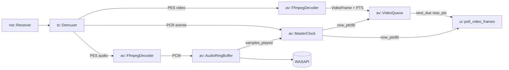

# TDD — Sprint 1: Sincronização A/V

| Campo              | Valor                                                                                                              |
| ------------------ | ------------------------------------------------------------------------------------------------------------------ |
| Tech Lead          | @matheusrodacki                                                                                                    |
| Time               | IronPlayer Core                                                                                                    |
| Epic               | Sprint 1 — Roadmap de Qualidade v0.3 §9                                                                            |
| Documentos pais    | [ironplayer-quality-roadmap-v0.3.md](ironplayer-quality-roadmap-v0.3.md), [ironstream-spec.md](ironstream-spec.md) |
| Status             | Draft                                                                                                              |
| Criado             | 2026-05-21                                                                                                         |
| Última atualização | 2026-05-21                                                                                                         |
| Tamanho estimado   | Médio (2–4 semanas)                                                                                                |

---

## 1. Contexto

O IronPlayer já reproduz MPEG-TS multicast com decodificação de A/V via FFmpeg e saída WASAPI/wgpu funcional. No entanto, sob carga real (SporTV 4K HEVC, GOP 50, E-AC-3 multicanal), o vídeo apresenta **engasgo periódico**: travamento de 50–200 ms seguido de flicker rápido enquanto o áudio segue contínuo.

**Causa-raiz** (cf. roadmap §1.2): não existe um *master clock* unificado no player.

- O áudio é tocado pelo clock independente da placa via WASAPI/cpal.
- O vídeo é apresentado em modo "best-effort": [crates/ui/src/lib.rs](../crates/ui/src/lib.rs) drena até 8 frames do canal, **descarta todos menos o último**, e faz upload imediato — sem agendamento por PTS.
- O produtor [src/channels.rs](../src/channels.rs) usa `try_send_latest` (drop-oldest) sem considerar PTS, podendo descartar B-frames que ainda seriam exibidos antes do próximo I/P.
- Não há tratamento de descontinuidade PCR/PTS wrap.

Adicionalmente, três lacunas operacionais de PSI/SI bloqueiam diagnóstico em headends reais: **CAT** ausente (impede análise de scrambling), **NIT em PID dinâmico** não roteado, e **TOT** (timezone/DST) não parseado.

**Domínio**: pipeline de A/V e PSI/SI em receptor profissional MPEG-TS.

**Stakeholders**: operadores de headend, engenheiros de qualidade de transmissão, time interno de QA.

---

## 2. Definição do Problema & Motivação

### 2.1 Problemas que estamos resolvendo

- **P1 — Engasgo de vídeo sob carga**: em 4K HEVC, vídeo trava ~100–200 ms por GOP enquanto áudio continua. Resultado: dessincronia perceptível e degradação visual.
  - Impacto: produto inviável para monitoração 24×7 em operadoras.
- **P2 — Drift A/V não-limitado**: sem master clock, não há mecanismo que force vídeo a reconvergir com áudio após pico de CPU/jitter.
  - Impacto: drift cresce monotonicamente; só resolve com reabrir o stream.
- **P3 — Descontinuidade PCR/PTS wrap quebra a reprodução**: após wrap de 33-bit (≈26.5 h) ou `discontinuity_indicator=1`, vídeo pode ficar horas "no futuro".
  - Impacto: stream travado até reabrir; bloqueia monitoração contínua.
- **P4 — Lacunas de PSI/SI**: sem CAT, sem NIT em PID dinâmico, sem TOT.
  - Impacto: diagnóstico de scrambling impossível; DTH com NIT fora de 0x0010 não exibe rede; timezone errado em EPG.
- **P5 — Ausência de fixtures reais**: cobertura atual baseia-se em fixtures sintéticas — regressões em streams de campo passam silenciosas.
  - Impacto: bugs de PSI/SI só aparecem em produção.

### 2.2 Por que agora?

- O roadmap v0.3 elege Sprint 1 como **pré-requisito** para Sprint 2 (GPU decode) e Sprint 3 (TR 101 290 completo): ambas dependem de um pipeline com clock estável.
- O engasgo é o primeiro feedback negativo de usuários internos validando o player com streams reais.
- CAT/NIT/TOT são *quick wins* compatíveis com o trabalho de PSI/SI já em curso.

---

## 3. Escopo

### 3.1 In Scope

- **Master clock selecionável** (`AudioClock`, `WallClock`, `StreamClock`) com default `AudioClock` quando há áudio.
- **`VideoQueue` por PTS** com políticas de *drop late* / *hold early* / *resync*.
- **Exposição de `AudioClockHandle`** a partir da callback cpal/WASAPI (contador atômico de samples consumidos).
- **Tratamento de descontinuidade PCR e wrap de PTS de 33 bits**.
- **Métricas de sync**: `av_sync_offset_ms`, `late_frames_dropped`, `early_frames_held`, `pts_discontinuities`.
- **CAT** (PID 0x0001, table_id 0x01): parsing, dispatch, exposição em `MetricsSnapshot`.
- **NIT em PID dinâmico**: registro via PAT (`program_number=0 → PID≠0x0010`), section assembly e dispatch.
- **TOT** (table_id 0x73, PID 0x0014): parsing UTC + `local_time_offset_descriptor`.
- **Fixtures reais**: 10 streams curtos recortados (15–60 s cada) salvos em `crates/ts/tests/fixtures/real/`, com snapshot tests de PAT/PMT/SDT/NIT.
- **Telemetria de sync na UI**: leitura do offset A/V no painel Métricas (gráfico de 60 s).

### 3.2 Out of Scope

- Decodificação acelerada por GPU (D3D11VA/NVDEC) — Sprint 2.
- Indicadores TR 101 290 não relacionados a sync (PID_error, CRC agregado, etc.) — Sprint 3.
- Painel de semáforo TR 101 290 — Sprint 3.
- EIT Schedule, painel EPG, descritores `linkage`/`parental_rating`/`component` — Sprint 4.
- Pass-through bitstream AC-3/E-AC-3 — Sprint 7.
- ATSC e ISDB-Tb — Sprints 5/6.
- Reescrita do `AudioRingBuffer` (apenas exposição do contador de samples; o algoritmo de catch-up permanece).
- Shader YUV→RGB consciente de HDR — depende de hwaccel (Sprint 2).

---

## 4. Solução Técnica

### 4.1 Visão arquitetural

Introduzir um **clock master compartilhado** ao qual o vídeo é agendado, e substituir o pipeline "best-effort" do vídeo por uma **fila ordenada por PTS** com política explícita de apresentação.



**Regras invariantes**:

- Áudio nunca é descartado nem reamostrado nessa fase. **Áudio dita o tempo do mundo.**
- Vídeo apresenta-se contra o `MasterClock`; nunca contra `Instant::now()` direto.
- **Nunca deslocar `AudioClockHandle::anchor_pts`** para alinhar PTS de vídeo ao mux. O skew de startup (vídeo só decodifica após o 1º IDR, ~1–2 s à frente do áudio no mux) é absorvido pela `VideoQueue` via hold-early/drop-late — não via `shift_anchor`. Deslocar a âncora faz o vídeo parecer sincronizado ao clock deslocado, mas adianta ~1–2 s vs o áudio audível (regressão confirmada em 2026-06-24; cf. STATE.md L-002).
- Toda apresentação de frame consulta `VideoQueue::next_due(now_pts)`; nenhum frame é apresentado sem agendamento.
- Descontinuidade PCR ou wrap de PTS dispara `MasterClock::reset()` + drain de `VideoQueue` + drain do `AudioRingBuffer`.

### 4.2 Contratos novos

#### 4.2.1 `av::clock`

```text
pub type Pts90 = i64;  // unidade canônica interna: 90 kHz, i64 com offset de wrap

pub trait Clock: Send + Sync {
    fn now_pts90(&self) -> Pts90;
    fn reset(&self, anchor_pts: Pts90);
}

pub enum MasterClock {
    Audio(AudioClockHandle),
    Wall(WallClockHandle),
    Pcr(PcrClockHandle),
}

pub struct AudioClockHandle {
    samples_played: Arc<AtomicU64>,
    sample_rate: u32,
    anchor_pts: AtomicI64,
}

impl Clock for AudioClockHandle { ... }
```

**Decisão D-009 (resolvida)**: unidade interna é `i64` em 90 kHz, compatível com FFmpeg. Wrap detectado quando `prev - new > 1<<32` → adiciona `0x2_0000_0000` ao offset acumulado.

#### 4.2.2 `av::video_queue`

```text
pub struct VideoQueue {
    heap: BinaryHeap<Reverse<PtsKeyed<VideoFrame>>>,
    capacity: usize,
    last_presented_pts: Option<Pts90>,
    metrics: Arc<SyncMetrics>,
}

impl VideoQueue {
    pub fn push(&mut self, frame: VideoFrame) -> PushOutcome;
    pub fn next_due(&mut self, now_pts: Pts90) -> NextDue;
    pub fn drain(&mut self);
    pub fn len(&self) -> usize;
}

pub enum PushOutcome { Inserted, DroppedOldestExpired, DroppedNewestFull }
pub enum NextDue { Frame(VideoFrame), HoldUntil(Pts90), Empty }
```

**Política de `next_due`**:

| Situação                               | Ação                                                            |
| -------------------------------------- | --------------------------------------------------------------- |
| `frame.pts < now_pts - DROP_THRESHOLD` | descarta + incrementa `late_frames_dropped` + tenta o próximo   |
| `frame.pts > now_pts + HOLD_THRESHOLD` | retorna `HoldUntil(frame.pts)` + incrementa `early_frames_held` |
| dentro da janela                       | retorna `Frame(frame)`                                          |
| heap vazio                             | retorna `Empty`                                                 |

#### 4.2.3 `MetricsSnapshot` (extensão)

```text
pub struct MetricsSnapshot {
    // ... campos existentes ...
    pub av_sync_offset_ms: i32,
    pub late_frames_dropped: u64,
    pub early_frames_held: u64,
    pub pts_discontinuities: u64,
    pub video_queue_depth: u16,
}
```

#### 4.2.4 PSI/SI

- `ts::demux::Demuxer::register_nit_pid(pid: u16)` — habilitado quando PAT entrega `program_number=0` com `PID ≠ 0x0010`.
- `ts::demux::Demuxer` passa a coletar PID 0x0001 (CAT) por padrão.
- `ts::tables::cat::Cat::parse(...)` — novo módulo; expõe `Vec<CaDescriptor>` com `(ca_system_id, ca_pid)`.
- `ts::tables::tot::Tot::parse(...)` — novo módulo; expõe `utc_time: DateTimeUtc` + `local_time_offset: Vec<LocalTimeOffsetDescriptor>`.
- `src::table_dispatcher` ganha branches: `0x01 => dispatch_cat`, `0x73 => dispatch_tot`.

### 4.3 Limiares iniciais

| Parâmetro              | Valor inicial | Justificativa                           |
| ---------------------- | ------------- | --------------------------------------- |
| `HOLD_THRESHOLD`       | 20 ms         | < 1 frame @ 50 fps                      |
| `DROP_THRESHOLD`       | 100 ms        | EBU R 37 limit (vídeo após áudio)       |
| `RESYNC_THRESHOLD`     | 500 ms        | descontinuidade ou stall pós-IDR        |
| `VideoQueue::capacity` | 64 frames     | absorve lead de startup (1º IDR ~1,5–2 s após áudio) + burst de I-frame |
| `AudioRingBuffer` alvo | 80 ms         | menor latência sem underrun             |
| Wrap detection         | `Δpts > 2^32` | margem segura para 33-bit               |

Todos exponíveis em runtime via painel "Debug A/V Sync" da UI.

### 4.4 Tratamento de descontinuidade

- `PcrTracker` já detecta `discontinuity_indicator`. Adiciona enum `PcrEvent::Discontinuity { new_pcr }`.
- `MasterClock` consome `PcrEvent::Discontinuity` via `tokio::sync::watch`:
  - chama `reset(anchor_pts = new_pcr)`,
  - drena `VideoQueue`,
  - sinaliza `AudioRingBuffer` para flush parcial (mantém ~20 ms para evitar pop).
- Contador `pts_discontinuities` é incrementado.

### 4.5 Fases de implementação (5)

1. **Fase A — Instrumentação**: emitir log de `(pts_video, audio_samples_played)` por frame entregue à UI; coletar drift por 60 s; **sem mudança de comportamento**. Critério: gráfico confirma o sintoma.
2. **Fase B — `AudioClockHandle`**: contador atômico de samples na callback cpal; `MasterClock::Audio` operacional, mas vídeo ainda usa pipeline atual.
3. **Fase C — `VideoQueue` por PTS**: substitui `try_send_latest` + drop-no-consumidor; ativa políticas drop/hold.
4. **Fase D — Descontinuidade & wrap**: integração `PcrEvent::Discontinuity` + offset de wrap.
5. **Fase E — Telemetria & UI**: painel "Sync A/V" mostra offset em ms, gráfico 60 s, contadores.

PSI/SI (CAT, NIT dinâmico, TOT) e fixtures reais correm em paralelo, sem dependência das fases A–E.

---

## 5. Riscos

| #   | Risco                                                                                                    | Probabilidade | Impacto | Mitigação                                                                                    |
| --- | -------------------------------------------------------------------------------------------------------- | ------------- | ------- | -------------------------------------------------------------------------------------------- |
| R1  | `AudioClock` deriva contra wall clock em hardware com clock impreciso (USB DAC, virtualização).          | Média         | Alto    | Detectar drift > 200 ppm em 60 s e cair para `WallClock`; expor warning na UI.               |
| R2  | `VideoQueue` cheia em streams com B-frames longos (HEVC GOP 50 + 4 B-frames) causa drops de I/P válidos. | Média         | Alto    | Capacidade 64 (lead de startup + burst); medir via `video_queue_depth` em testes reais; ajustar antes do merge. |
| R3  | Wrap de PTS detectado erroneamente em stream com discontinuity sem indicator (provedor mal configurado). | Baixa         | Médio   | Wrap exige `Δ > 2^32`; descontinuidade legítima dispara `RESYNC_THRESHOLD` antes.            |
| R4  | Mudança no contrato `MetricsSnapshot` quebra UI antiga (consumidor `tokio::sync::watch`).                | Baixa         | Baixo   | Adicionar campos novos com `#[serde(default)]` equivalente em estrutura interna.             |
| R5  | CAT vazio em streams FTA gera falso-positivo de "scrambled" se a UI interpretar mal.                     | Baixa         | Baixo   | CAT ausente ≠ scrambling; UI só sinaliza CA quando `transport_scrambling_control != 0`.      |
| R6  | NIT em PID dinâmico colide com PID já mapeado para PES em stream patológico.                             | Muito baixa   | Médio   | Demuxer registra NIT apenas se PID não tiver PMT-PID nem PES-PID ativo; senão logga warning. |
| R7  | Fase A em produção polui logs (1 linha por frame ≈ 50/s).                                                | Alta          | Baixo   | Flag `--debug-av-sync` em [src/config.rs](../src/config.rs); off por padrão.                 |
| R8  | Limiares 20/100/500 ms não são universais — streams com jitter alto podem ter falso *late drop*.         | Média         | Médio   | Tornar runtime-tunable; documentar em [docs/](.) presets por perfil (DTH, IPTV, terrestre).  |
| R9  | Compartilhamento de `AtomicU64` entre thread cpal e thread de leitura causa contenção em CPU fraca.      | Muito baixa   | Baixo   | `Ordering::Relaxed` é suficiente; benchmark em laptop i5 antes de merge.                     |
| R10 | Sem fixtures reais salvas hoje — pode haver dependência implícita de comportamento sintético.            | Média         | Médio   | Capturar 10 streams listados em §4.7 do roadmap antes de iniciar Fase C.                     |

---

## 6. Plano de Implementação

### Sequência

| Ordem | Tarefa                                                            | Crate(s)          | Dependência |
| ----- | ----------------------------------------------------------------- | ----------------- | ----------- |
| 1     | Capturar 10 fixtures reais (15–60 s cada) e versionar com Git LFS | `ts/tests`        | —           |
| 2     | Snapshot tests PAT/PMT/SDT contra fixtures reais                  | `ts`              | 1           |
| 3     | Implementar CAT (parse + dispatcher + métricas)                   | `ts`, `src`       | —           |
| 4     | NIT em PID dinâmico (`register_nit_pid`) + teste                  | `ts`              | —           |
| 5     | TOT + descritor `local_time_offset` + dispatcher                  | `ts`, `src`       | —           |
| 6     | **Fase A** — logs estruturados de PTS vídeo + samples_played      | `av`, `ui`        | —           |
| 7     | **Fase B** — `AudioClockHandle` + `MasterClock` trait             | `av`              | 6           |
| 8     | **Fase C** — `VideoQueue` + integração no dispatcher de frames    | `av`, `ui`, `src` | 7           |
| 9     | **Fase D** — `PcrEvent::Discontinuity` + wrap PTS 33-bit          | `ts`, `av`        | 8           |
| 10    | **Fase E** — telemetria `av_sync_offset_ms` + painel UI           | `ts`, `ui`        | 9           |
| 11    | Validação end-to-end com fixtures reais (drift < 40 ms / 5 min)   | E2E               | 1–10        |

### Critério de "Done" por tarefa

- Toda função pública nova tem `SPEC-ID` em doc-comment e teste com prefixo `spec_<id>_*`.
- `cargo test -p <crate>` verde.
- `cargo clippy -p <crate> -- -D warnings` sem avisos.
- Zero `unwrap`/`expect` em paths de dados externos.
- Doc do módulo aponta para a seção deste TDD e para o roadmap §2.

### SPEC-IDs novos a alocar

- `SPEC-AV-CLOCK-001..00N` — `MasterClock` e `AudioClockHandle`.
- `SPEC-AV-VQ-001..00N` — `VideoQueue`.
- `SPEC-AV-SYNC-001..00N` — políticas de drop/hold/resync.
- `SPEC-TS-CAT-001..00N` — CAT.
- `SPEC-TS-NIT-DYN-001..00N` — NIT em PID dinâmico.
- `SPEC-TABLE-TOT-001..00N` — TOT.
- `SPEC-METRICS-SYNC-001..00N` — métricas de sincronização.

Definir nas specs detalhadas em `.specs/features/spec-08-av-sync/` (criar) e atualizar `.specs/README.md`.

---

## 7. Estratégia de Testes

### 7.1 Unitários

- `VideoQueue::next_due` com PTS sintéticos: caso *in-window*, *late*, *early*, *empty*, *wrap*.
- `AudioClockHandle::now_pts90` com `samples_played` incrementado por step de buffer cpal.
- Wrap de PTS: pares `(prev, new)` cruzando 2^33 e jumps legítimos.
- CAT: pacote válido, CRC inválido, tabela vazia, multi-section.
- TOT: UTC válido, BCD inválido, `local_time_offset_descriptor` ausente/presente.
- NIT em PID dinâmico: PAT com `program_number=0 → 0x10AB` registra o PID, demux roteia seções.

### 7.2 Integração (`crates/*/tests/`)

- Fixtures sintéticas existentes seguem passando.
- Novas fixtures reais (§6 ordem 1–2) validam parse byte-exato.
- `tables_flow.rs` ganha cenário "CAT + NIT dinâmico + TOT presentes".

### 7.3 End-to-end

- **E2E-1** — Drift sustentado: reproduzir fixture SporTV 4K HEVC + E-AC-3 por 5 min em modo headless (sem render) e verificar `|av_sync_offset_ms| < 40` p99.
- **E2E-2** — Descontinuidade: fixture com `discontinuity_indicator=1` no meio; verificar reset do clock e `pts_discontinuities += 1`.
- **E2E-3** — Wrap simulado: fixture sintética com PTS perto de 2^33; verificar continuidade.
- **E2E-4** — Stream FTA + scrambled: verificar CAT parseado em ambos sem panic.

### 7.4 Fuzz

- Adicionar `cargo-fuzz` target para `Cat::parse` e `Tot::parse` (consistente com plano §8 do roadmap).

### 7.5 Cobertura mínima

- `av::clock`: ≥ 90 %.
- `av::video_queue`: ≥ 95 %.
- `ts::tables::cat`, `ts::tables::tot`: ≥ 85 %.

---

## 8. Monitoramento & Observabilidade

### 8.1 Métricas expostas em `MetricsSnapshot`

| Métrica                | Tipo   | Unidade | Painel          |
| ---------------------- | ------ | ------- | --------------- |
| `av_sync_offset_ms`    | gauge  | ms      | Sync A/V (novo) |
| `late_frames_dropped`  | count  | frames  | Sync A/V        |
| `early_frames_held`    | count  | eventos | Sync A/V        |
| `pts_discontinuities`  | count  | eventos | Sync A/V + log  |
| `video_queue_depth`    | gauge  | frames  | Sync A/V        |
| `audio_buffer_fill_ms` | gauge  | ms      | Áudio           |
| `cat_present`          | bool   | —       | PSI/SI          |
| `tot_utc`              | string | ISO8601 | PSI/SI          |
| `nit_pid_actual`       | u16    | PID     | PSI/SI          |

### 8.2 Logs estruturados (via `tracing`)

- `av_sync.drop_late { pts, now_pts, delta_ms }` — rate-limit 1/s.
- `av_sync.hold_early { pts, now_pts, delta_ms }` — rate-limit 1/s.
- `av_sync.discontinuity { old_pcr, new_pcr }` — sempre.
- `av_sync.wrap_detected { offset }` — sempre.
- `psi.cat_received { ca_systems: [...] }` — uma vez por mudança.
- `psi.nit_pid_registered { pid }` — uma vez por mudança.
- `psi.tot_received { utc, lto }` — rate-limit 1/min.

### 8.3 Painel "Sync A/V" (UI)

- Linha do tempo de 60 s do offset (gráfico).
- Contadores absolutos de drop/hold/discontinuity.
- Profundidade atual do `VideoQueue`.
- Limiares atuais (editáveis).

---

## 9. Plano de Rollback

Sprint 1 não muda formato de dados persistidos, nem APIs externas — rollback é por *git revert* do merge na branch `main` mais re-build.

**Passos**:

1. `git revert <merge-commit>` na branch `main`.
2. `cargo build --release`.
3. Re-distribuir binário.
4. Confirmar via fixture E2E-1 que comportamento volta ao baseline pré-sprint (engasgo presente).

**Rollback parcial por fase**: cada fase (A–E) entra em commit isolado; é possível reverter Fases C+D+E mantendo A+B (instrumentação + AudioClock) caso `VideoQueue` introduza regressão grave.

A implementação é **atômica**: não há modo legado nem feature flag. O pipeline antigo é removido integralmente no merge da Fase C.

---

## 10. Métricas de Sucesso

Critérios quantitativos, alinhados com §10 do roadmap:

| ID  | Métrica                                                                         | Meta                          |
| --- | ------------------------------------------------------------------------------- | ----------------------------- |
| M1  | Drift A/V (SporTV 4K, 5 min, CPU decode)                                        | p99 \|offset\| < 40 ms        |
| M2  | `late_frames_dropped` em stream limpo                                           | < 1 frame/s média             |
| M3  | Recuperação após descontinuidade injetada                                       | < 500 ms até `offset` < 40 ms |
| M4  | CPU adicional do `MasterClock + VideoQueue` em i5 8ª gen                        | < 2 %                         |
| M5  | Cobertura de parse byte-exato vs Promax nas 10 fixtures reais (PAT/PMT/SDT/NIT) | 10/10                         |
| M6  | CAT parseado corretamente em ≥ 1 fixture scrambled                              | sim                           |
| M7  | TOT parseado com timezone Brasil (UTC−3)                                        | sim                           |
| M8  | Zero panic em fuzz de 10⁶ pacotes contra `Cat`/`Tot`                            | sim                           |

---

## 11. Dependências

- **Internas**: nenhuma — `ts`, `av`, `ui`, `src` já existem.
- **Externas**:
  - `crossbeam-channel` 0.5 (já presente) — para canais bounded.
  - `tokio::sync::watch` (já presente) — para clock broadcasting.
  - **Sem novas crates obrigatórias.** Considerar `priority-queue` 2.x se `BinaryHeap` mostrar contenção; decidir após benchmark da Fase C.
- **Operacionais**:
  - Captura de 10 fixtures reais (~50 MB) versionadas via Git LFS. Configurar LFS se ainda não estiver.
  - Hardware-alvo de validação: laptop i5 8ª gen com GPU integrada Intel UHD 620 (definido em §10.3 do roadmap).

---

## 12. Decisões em Aberto

| ID    | Decisão                                                                           | Encaminhamento                                                                      |
| ----- | --------------------------------------------------------------------------------- | ----------------------------------------------------------------------------------- |
| D-008 | Master clock default = áudio quando há áudio; wall caso contrário.                | **Resolvida** — adotar nesta sprint.                                                |
| D-009 | Unidade PTS interna = `i64` em 90 kHz.                                            | **Resolvida** — adotar nesta sprint.                                                |
| D-013 | Onde mora o `VideoQueue` — `crates/av` ou `crates/ts`?                            | **Proposta**: `crates/av` (consome `VideoFrame` decodificado).                      |
| D-014 | Limiares 20/100/500 ms são presets fixos ou perfil por modo (DTH/IPTV/terrestre)? | Decidir após coletar fixtures reais (E2E).                                          |
| D-015 | ~~Feature flag `IRONPLAYER_AV_SYNC=legacy`~~                                      | **Cancelada** — implementação atômica; pipeline legado removido no merge da Fase C. |
| D-016 | `AudioClockHandle::sample_rate` é fixo ou recriado em sample-rate-change?         | Decidir na Fase B; provavelmente recriado.                                          |

---

## 13. Alternativas Consideradas

1. **Manter pipeline best-effort com buffer maior** — testado mentalmente: aumenta latência sem resolver drift; rejeitado.
2. **Master clock = wall clock sempre** — simples, mas força reamostragem de áudio (catch-up agressivo) → audível como wow/flutter; rejeitado para esta sprint.
3. **Master clock = PCR sempre** — PCR pode estar com jitter alto em redes IP; exige tracker de PCR sólido (parcial hoje); rejeitado para default, mantido como modo opcional.
4. **Reamostragem de áudio para casar com vídeo** — inverte a invariante "áudio dita o tempo"; alta complexidade DSP; postergado para sprint futura se necessário.
5. **Usar `libav` filter graph `setpts`** — não resolve sem clock externo; só reordena pacotes; rejeitado.

---

## 14. Glossário

| Termo             | Definição                                                                                                                |
| ----------------- | ------------------------------------------------------------------------------------------------------------------------ |
| PTS               | *Presentation Time Stamp*, 33 bits, escala 90 kHz, declarado no header PES.                                              |
| PCR               | *Program Clock Reference*, 42 bits, escala 27 MHz, em campos de adaptação do TS.                                         |
| GOP               | *Group of Pictures* — distância entre I-frames consecutivos.                                                             |
| Drift             | Deriva acumulada entre dois clocks (áudio vs vídeo, ou stream vs wall).                                                  |
| CAT               | *Conditional Access Table* — ISO 13818-1 §2.4.4.6, PID 0x0001, lista EMM PIDs.                                           |
| TOT               | *Time Offset Table* — EN 300 468 §5.2.6, PID 0x0014, table_id 0x73; UTC + descritor de timezone.                         |
| NIT               | *Network Information Table* — EN 300 468 §5.2.1; pode estar em PID 0x0010 (default) ou em PID dinâmico declarado na PAT. |
| EBU R 37          | *Recommendation R 37* — limites de tolerância audiovisual: vídeo até −60 ms / +20 ms vs áudio.                           |
| `try_send_latest` | Padrão de envio "drop-oldest" em canal bounded.                                                                          |

---

## 15. Referências

- [docs/ironplayer-quality-roadmap-v0.3.md](ironplayer-quality-roadmap-v0.3.md) §1, §2, §4.2, §8, §9, §10
- [docs/ironstream-spec.md](ironstream-spec.md) — workspace e contratos de canal
- ISO/IEC 13818-1 §2.4.3 (PES header), §2.4.4.6 (CAT)
- ETSI EN 300 468 v1.16.1 §5.2.1 (NIT), §5.2.6 (TOT)
- ETSI TR 101 290 v1.4.1 §5.2 (PCR_accuracy / PTS_error)
- EBU R 37 (tolerância audiovisual)
- ITU-R BT.1359-1 (sincronização A/V)
