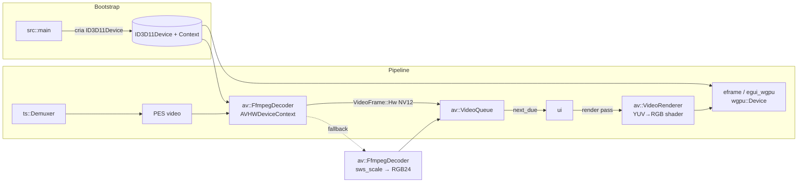

# TDD — Sprint 2: Decode acelerado por GPU (D3D11VA)

| Campo              | Valor                                                                                                                                          |
| ------------------ | ---------------------------------------------------------------------------------------------------------------------------------------------- |
| Tech Lead          | @matheusrodacki                                                                                                                                |
| Time               | IronPlayer Core                                                                                                                                |
| Epic               | Sprint 2 — Roadmap de Qualidade v0.3 §9                                                                                                        |
| Documentos pais    | [ironplayer-quality-roadmap-v0.3.md](../../../docs/ironplayer-quality-roadmap-v0.3.md), [ironstream-spec.md](../../../docs/ironstream-spec.md) |
| Sprint anterior    | [spec-08-av-sync/tdd-sprint-01-av-sync.md](../spec-08-av-sync/tdd-sprint-01-av-sync.md)                                                        |
| Status             | Draft                                                                                                                                          |
| Criado             | 2026-05-22                                                                                                                                     |
| Última atualização | 2026-05-22                                                                                                                                     |
| Tamanho estimado   | Grande (4–6 semanas)                                                                                                                           |

---

## 1. Contexto

Após a Sprint 1, o IronPlayer tem master clock e `VideoQueue` por PTS — o vídeo está agendado contra o áudio e o drift está sob controle em streams 1080p. Porém, **a decodificação HEVC 4K continua sendo o gargalo**: em laptop i5 8ª geração, `libavcodec` software consome 200–400 % de 1 core físico e o decoder atrasa 50–200 ms por GOP. Mesmo com o `VideoQueue`, frames cronicamente atrasados acabam descartados pela política `DROP_THRESHOLD`, gerando "queda de fps" visível.

O caminho de pixels atual também é caro: [crates/av/src/decoder.rs](../../../crates/av/src/decoder.rs#L279) chama `av_frame.to_rgb24()` (sws_scale CPU YUV→RGB), produzindo `Vec<u8>` com 8.3 MB/frame @ 1080p ou ~33 MB/frame @ 4K, que depois sobe para `wgpu::Texture` em [crates/av/src/renderer.rs](../../../crates/av/src/renderer.rs). É **conversão de cor + cópia CPU→GPU por frame**.

**Causa-raiz**: decodificação por software + conversão de cor por software + upload CPU→GPU por frame.

**Solução proposta** (cf. roadmap §3): adotar **D3D11VA como hwaccel primário** no FFmpeg, **compartilhar o `ID3D11Device`** com o `wgpu::Device` do `eframe`/`egui_wgpu`, e renderizar a textura NV12/P010 diretamente via shader YUV→RGB no GPU.

**Domínio**: pipeline de decode e renderização de vídeo em receptor profissional MPEG-TS, Windows 10/11 x86-64.

**Stakeholders**: operadores monitorando 4K HEVC e (futuro) AV1; usuários em laptops sem GPU dedicada; time de QA.

---

## 2. Definição do Problema & Motivação

### 2.1 Problemas

- **P1 — CPU excessiva em 4K HEVC**: decode software satura 1 core físico mesmo com `threads=auto`; sob carga, IDR-bursts atrasam 100–200 ms.
  - Impacto: violação do critério §10.3 do roadmap (CPU < 60 % em i5 8ª gen reproduzindo 4K HEVC).
- **P2 — Conversão YUV→RGB e upload por frame**: 33 MB CPU↔GPU por frame @ 4K 50p ≈ 1.65 GB/s só de cópia.
  - Impacto: pico de uso de memória; latência adicional; calor em laptop.
- **P3 — AV1 inviável em CPU**: 4K60 AV1 software exige 8+ cores potentes; bloqueia roadmap futuro.
  - Impacto: incompatibilidade com next-gen streams.
- **P4 — HDR (PQ/HLG) impossível sem shader**: pipeline RGB24 limita a SDR Rec.709; perdemos metadados HDR10 já carregados pelo decoder.
  - Impacto: streams 4K HDR exibidos com clipping / cor errada.

### 2.2 Por que agora?

- Sprint 1 entrega a base de clock para esta sprint: `VideoQueue` espera frames com PTS confiável; com decode lento, mesmo o clock perfeito não salva.
- D3D11VA + wgpu compartilhando `ID3D11Device` é caminho mais barato que NVDEC/QSV (vendor-neutral) e exigível pelo critério "Dektec-grade" §10.
- HDR aparece no PRD próximo (operadoras Globo SC, SporTV 4K HDR) — precisamos de shader path antes.

---

## 3. Escopo

### 3.1 In Scope

- **D3D11VA hwaccel no FFmpeg**: criação de `AVHWDeviceContext`/`AVHWFramesContext` com `AV_PIX_FMT_D3D11` (variante array), `get_format` callback, `hw_frames_ctx` no `AVCodecContext`.
- **Fallback automático para decode CPU**: qualquer falha de inicialização hwaccel (driver ausente, RDP, codec não suportado pelo VA) retorna ao caminho atual.
- **Shared `ID3D11Device`**: criar manualmente o device D3D11 e injetá-lo tanto no FFmpeg quanto no `eframe::NativeOptions::renderer` / `egui_wgpu::WgpuConfiguration` (via callback de setup) para que `wgpu::Device` e `AVHWDeviceContext` compartilhem a mesma `ID3D11Device`.
- **Zero-copy texture path NV12 / P010**: `VideoFrame` ganha variante `Hw(D3D11Texture)` carregando `ID3D11Texture2D` + índice de slice; `VideoRenderer` consome direto via `wgpu::hal` (sem `to_rgb24`, sem `sws_scale`).
- **Shader YUV→RGB** consciente de Rec.601 / Rec.709 / Rec.2020 + transferência (BT.1886 / PQ / HLG); seleção via metadados do `AVFrame` (`colorspace`, `color_primaries`, `color_trc`).
- **Codecs cobertos**: H.264, HEVC, MPEG-2; AV1 atrás de feature flag (FFmpeg ≥ 7.x decoder estável, hwaccel via D3D11VA depende do GPU; cair em CPU se não suportado).
- **CLI/config**: `--hwaccel {auto,d3d11va,none}` em [src/config.rs](../../../src/config.rs) + entrada equivalente em `ironstream.toml`; toggle de runtime no painel "Debug A/V".
- **Métricas novas**: `hw_decode_active` (bool), `hw_decode_codec` (string), `hw_decode_fallback_reason` (string opcional), `gpu_upload_bytes_per_s` (gauge).
- **Telemetria de hwaccel**: log estruturado em transição CPU↔GPU; aviso de UI quando hwaccel solicitado falha.
- **Testes E2E**: medir CPU/GPU em fixtures 4K HEVC SDR e HDR; comparar contra baseline software.

### 3.2 Out of Scope

- NVDEC/CUDA dedicado — postergado (roadmap §3.2 marcou "alto custo"); usuários NVIDIA usam D3D11VA por padrão.
- Intel QSV dedicado — idem.
- DXVA2 legado (pré-Win10) — fora do alvo de plataforma.
- Encode/transcode — IronPlayer é apenas player/analyzer.
- Linux/Mac (VAAPI, VideoToolbox) — fora do escopo de plataforma (Windows 10/11 x86-64).
- Tone-mapping HDR→SDR — Sprint futura (display HDR detection precede); nesta sprint apenas **passar** PQ/HLG ao egui_wgpu render target compatível ou degradar para SDR Rec.709 com clipping documentado.
- Decode de áudio em GPU — irrelevante.
- Substituição do egui_wgpu por backend custom — não.
- Pass-through bitstream AC-3/E-AC-3 (Sprint 7).

---

## 4. Solução Técnica

### 4.1 Visão arquitetural



**Invariantes**:

- Há **exatamente um** `ID3D11Device` no processo. Tanto FFmpeg quanto wgpu o referenciam por `IUnknown::AddRef`/`Release`.
- `VideoQueue` é polimórfico em `VideoFrame::{Sw(Bytes), Hw(D3D11Texture)}`; políticas de drop/hold de Sprint 1 permanecem inalteradas.
- Fallback CPU é **automático e silencioso na primeira tentativa**, com log estruturado e flag em `MetricsSnapshot`.
- Toda chamada FFI nova confinada em `crates/av/src/ffi/` e `crates/av/src/hw/` (novo); zero `unsafe` fora desses módulos.
- Quando hwaccel está ativo, **nenhuma cópia CPU↔GPU do plano de pixels acontece** entre decoder e render pass.

### 4.2 Contratos novos

#### 4.2.1 `av::hw` (novo)

```text
// crates/av/src/hw/mod.rs
pub struct D3d11Device {
    raw_device: *mut ID3D11Device,     // confinado a este módulo
    raw_context: *mut ID3D11DeviceContext,
    adapter_luid: u64,
}

impl D3d11Device {
    pub fn new() -> Result<Arc<Self>, AvError>;
    pub fn as_raw(&self) -> *mut ID3D11Device;   // unsafe-internal: consumido por FFmpeg
    pub fn adapter_luid(&self) -> u64;
}

pub struct D3d11Texture {
    texture: *mut ID3D11Texture2D,
    array_slice: u32,
    format: HwPixelFormat,             // Nv12 | P010 | Yuv420P10
    width: u32,
    height: u32,
    color_space: ColorSpace,           // BT601 | BT709 | BT2020
    transfer: TransferFunction,        // BT1886 | PQ | HLG | SRGB
    full_range: bool,
}

impl D3d11Texture {
    pub fn into_wgpu(&self, device: &wgpu::Device) -> Result<wgpu::Texture, AvError>;
}
```

**Segurança**: ponteiros COM são `*mut` mas tratados com `Arc` + `AddRef/Release` em `Drop`. `Send + Sync` é seguro porque o D3D11 *immediate context* é usado apenas pela thread do decoder (a textura final é compartilhada via wgpu, que faz seu próprio sync).

#### 4.2.2 `av::renderer::VideoFrame` (extensão)

```text
pub enum VideoFrameKind {
    Sw(SoftwareFrame),       // RGB24 atual
    Hw(D3d11Texture),        // zero-copy
}

pub struct VideoFrame {
    pub pts: Option<u64>,
    pub width: u32,
    pub height: u32,
    pub sar_num: u32,
    pub sar_den: u32,
    pub kind: VideoFrameKind,
}
```

Métodos públicos existentes (`new`, `is_valid_size`) preservam compatibilidade para callers de SW; novos callers usam o `kind` explicitamente.

#### 4.2.3 `av::FfmpegDecoder` (extensão)

```text
pub struct FfmpegDecoder {
    // existente
    hwaccel: HwAccelMode,            // Off | D3d11Va(Arc<D3d11Device>)
    fallback_reason: Option<String>,
}

pub enum HwAccelMode {
    Off,
    D3d11Va(Arc<D3d11Device>),
}

impl FfmpegDecoder {
    pub fn new(...) -> Result<Self, AvError>;
    pub fn enable_hwaccel(&mut self, mode: HwAccelMode) -> Result<(), AvError>;
    pub fn fallback_to_sw(&mut self, reason: impl Into<String>);
}
```

O `get_format` callback do `AVCodecContext` seleciona `AV_PIX_FMT_D3D11` se disponível e retorna o pix_fmt original (NV12/YUV420P) caso contrário, disparando fallback CPU para aquela stream.

#### 4.2.4 `av::renderer::VideoRenderer` (extensão)

```text
impl VideoRenderer {
    pub fn upload(&self, frame: &VideoFrame, queue: &wgpu::Queue) -> TextureId;
    fn upload_sw(&self, frame: &SoftwareFrame, queue: &wgpu::Queue) -> TextureId;  // existente
    fn upload_hw(&self, tex: &D3d11Texture) -> TextureId;                          // novo: zero-copy
    fn yuv_pipeline(&self, cs: ColorSpace, trc: TransferFunction) -> &wgpu::RenderPipeline;
}
```

O render pass NV12/P010 usa dois `wgpu::TextureView` (plano Y e plano UV) sobre a mesma `ID3D11Texture2D` (via `wgpu::hal::dx12::Texture::from_raw` ou ponte equivalente do backend D3D11) e um shader WGSL parametrizado por matriz YUV→RGB + LUT/curva de transferência.

#### 4.2.5 `MetricsSnapshot` (extensão)

```text
pub struct MetricsSnapshot {
    // ...
    pub hw_decode_active: bool,
    pub hw_decode_codec: Option<String>,        // "hevc_d3d11va", "h264_d3d11va", ...
    pub hw_decode_fallback_reason: Option<String>,
    pub gpu_upload_bytes_per_s: u64,            // 0 quando hw ativo (sem upload)
}
```

#### 4.2.6 `src::config::PlayerConfig` (extensão)

```text
pub struct PlayerConfig {
    // ...
    pub hwaccel: HwAccelChoice,       // Auto (default) | D3d11Va | None
}

pub enum HwAccelChoice { Auto, D3d11Va, None }
```

CLI: `--hwaccel auto|d3d11va|none`.

### 4.3 Limiares iniciais

| Parâmetro                           | Valor inicial     | Justificativa                                                            |
| ----------------------------------- | ----------------- | ------------------------------------------------------------------------ |
| `HW_DECODE_INIT_TIMEOUT`            | 2 s               | falha rápida → fallback CPU                                              |
| `HW_FRAME_POOL_SIZE`                | 24 frames         | absorve B-frames HEVC + reorder + `VideoQueue::capacity` (16) + margem   |
| `HW_DOWNLOAD_THRESHOLD`             | nunca             | downloads CPU↔GPU disparam warning de telemetria                         |
| Threshold de fallback automático    | 3 falhas seguidas | 3 frames consecutivos retornando `AVERROR(ENOMEM)` ou pix_fmt inesperado |
| Detecção de adapter mismatch (LUID) | obrigatório       | se LUID do `wgpu::Adapter` ≠ `D3d11Device`, recriar wgpu sobre o mesmo   |

### 4.4 Caminho de cor

| Codespace de entrada    | Matriz YUV→RGB | TRC (transfer)     | Saída                                                             |
| ----------------------- | -------------- | ------------------ | ----------------------------------------------------------------- |
| Rec.601 SDTV (NTSC/PAL) | BT.601         | BT.1886            | sRGB Rec.709                                                      |
| Rec.709 HDTV            | BT.709         | BT.1886            | sRGB Rec.709                                                      |
| Rec.2020 SDR            | BT.2020 NCL    | BT.1886            | sRGB com matriz de adaptação                                      |
| Rec.2020 PQ (HDR10)     | BT.2020 NCL    | SMPTE ST 2084 (PQ) | sRGB com tone-mapping naive (clipping log; full em sprint futura) |
| Rec.2020 HLG            | BT.2020 NCL    | ARIB STD-B67 (HLG) | sRGB com tone-mapping naive                                       |

Metadados extraídos por `AVFrame::colorspace`, `color_primaries`, `color_trc`, `color_range`. Defaults seguros (BT.709 limited range) quando ausentes.

### 4.5 Fases de implementação (5)

1. **Fase A — Bootstrap D3D11 compartilhado**: criar `D3d11Device` standalone (sem FFmpeg), validar adapter LUID, redirecionar `eframe` para usar este device via `WgpuConfiguration` customizado. Sem mudança no decoder. Critério: app sobe normalmente, `wgpu::Adapter::get_info().vendor` corresponde ao LUID esperado.

2. **Fase B — FFmpeg D3D11VA + fallback**: introduzir `HwAccelMode`, `get_format` callback, `AVHWDeviceContext`, `AVHWFramesContext`; decoder devolve `VideoFrame::Hw` mas o `VideoRenderer` ainda faz **download** (`av_hwframe_transfer_data`) → RGB24 (caminho SW). Critério: hwaccel sobe sem crash, fallback automático testado por desabilitar driver.

3. **Fase C — Zero-copy NV12**: `VideoRenderer::upload_hw` consome `ID3D11Texture2D` direto; shader WGSL YUV→RGB com BT.709. Apenas H.264/HEVC 8-bit SDR. Critério: CPU < 60 % em 4K HEVC SDR; nenhum `av_hwframe_transfer_data` chamado.

4. **Fase D — P010 / HDR10 / HLG**: shader parametrizado por TRC; pipeline P010 (10-bit) sem perda de profundidade até o render target final (mantém f16 intermediário). Critério: SporTV 4K HDR10 reproduz com cores plausíveis (mesma matriz que mpv `--vo=gpu`).

5. **Fase E — Telemetria & UI**: painel "Debug A/V" mostra hwaccel ativo, codec, motivo de fallback, FPS, e bytes/s de upload. Toggle runtime `--hwaccel`. Critério: alternar Auto↔None em runtime sem reabrir o stream.

---

## 5. Riscos

| #   | Risco                                                                                                                 | Probabilidade | Impacto | Mitigação                                                                                                                                   |
| --- | --------------------------------------------------------------------------------------------------------------------- | ------------- | ------- | ------------------------------------------------------------------------------------------------------------------------------------------- |
| R1  | `eframe` 0.29 não expõe API para injetar `wgpu::Device` pré-criado.                                                   | Média         | Alto    | Validar na Fase A; se bloqueado, criar PR upstream ou usar `egui_wgpu::winit` standalone (sem `eframe`). Definir vai/não-vai no kick-off.   |
| R2  | wgpu D3D11 backend é menos maduro que D3D12; faltam APIs `from_raw` para `ID3D11Texture2D` em algumas versões.        | Média         | Alto    | Testar com wgpu 22+; se faltar, manter `download → upload`. Documentar como D-019.                                                          |
| R3  | NV12/P010 planar exige duas `TextureView` sobre o mesmo recurso; D3D11 limita formato/usage por subresource.          | Média         | Médio   | Criar shader que amostra `R8` + `R8G8` (planos Y/UV) com offsets de array slice; validar com fixture H.264 NV12.                            |
| R4  | LUID mismatch em multi-GPU (laptop com iGPU+dGPU, Optimus): wgpu pega dGPU, FFmpeg pega iGPU.                         | Alta          | Alto    | Forçar adapter por LUID em ambos; expor escolha em `PlayerConfig::gpu_adapter_luid`.                                                        |
| R5  | Driver não suporta HEVC Main10 D3D11VA (GPU antiga); decoder atribui contexto, mas frames vêm corrompidos.            | Média         | Alto    | Detectar via `IDXVAHD_Device::CheckVideoDecoderFormat` ou heurística "3 frames CRC inválidos" → fallback.                                   |
| R6  | RDP / Sessão remota desabilita aceleração; user spawn no RDP cai em fallback mesmo com `--hwaccel d3d11va`.           | Baixa         | Baixo   | Fallback automático já cobre; UI exibe warning.                                                                                             |
| R7  | Reaproveitamento do `ID3D11Device` entre threads (decoder thread + renderer thread) gera contenção do device context. | Média         | Médio   | Usar `ID3D11Multithread::SetMultithreadProtected(true)`; benchmark.                                                                         |
| R8  | Reset de device (driver crash, TDR) invalida texturas vivas no `VideoQueue`.                                          | Baixa         | Alto    | Capturar `DXGI_ERROR_DEVICE_REMOVED` no render pass; drenar `VideoQueue`, recriar `D3d11Device`, sinalizar `MasterClock::reset` (Sprint 1). |
| R9  | AV1 D3D11VA exige Windows 11 + GPU recente; ativar AV1 quebra em Win10.                                               | Média         | Médio   | AV1 atrás de feature flag em [src/config.rs](../../../src/config.rs); detecção em runtime.                                                  |
| R10 | HDR PQ exibido em monitor SDR sem tone-mapping fica "queimado" (high lights blown).                                   | Alta          | Médio   | Fase D entrega clipping documentado; tone-mapping completo é Sprint futura. UI mostra badge "HDR not mapped".                               |
| R11 | Dependência de novas dll/COM (D3D11.dll, DXGI.dll) — sempre disponíveis no Win10/11 mas exigem carregamento dinâmico. | Baixa         | Baixo   | `LoadLibrary` lazy igual ao FFmpeg; falha → fallback SW.                                                                                    |
| R12 | Regressão de cor em SDR Rec.709 limited range vs full range (operadora envia mal-marcado).                            | Média         | Médio   | Snapshot tests pixel-exatos contra `mpv --vo=gpu` em 5 fixtures; tolerância ΔE < 2.                                                         |
| R13 | Aumento de uso de VRAM (24-frame pool + textura wgpu) em GPU integrada com 128 MB compartilhados.                     | Média         | Médio   | `HW_FRAME_POOL_SIZE` configurável; degradar para 8 em adapters com `dedicated_video_memory < 256 MB`.                                       |
| R14 | Sincronização A/V (Sprint 1) regrediu por mudança no caminho de PTS (hwaccel altera ordem de entrega).                | Baixa         | Alto    | E2E reusa critério Sprint 1: drift < 40 ms p99 / 5 min em 4K HEVC.                                                                          |
| R15 | Testes E2E exigem GPU real — CI Windows runner padrão (GitHub Actions) tem GPU virtual sem DXVA.                      | Alta          | Baixo   | Marker `#[ignore]` + runner self-hosted com GPU; testes SW continuam em CI público.                                                         |

---

## 6. Plano de Implementação

### Sequência

| Ordem | Tarefa                                                                                            | Crate(s)          | Dependência                   |
| ----- | ------------------------------------------------------------------------------------------------- | ----------------- | ----------------------------- |
| 1     | Validar API `eframe`/`egui_wgpu` 0.29 para injetar `wgpu::Device` (spike Fase A go/no-go)         | `ui`, `src`       | —                             |
| 2     | Adicionar bindings COM mínimos para `ID3D11Device`, `IDXGIAdapter`, `ID3D11Texture2D` em `av::hw` | `av`              | —                             |
| 3     | **Fase A** — criar `D3d11Device`, expor LUID, redirecionar wgpu para mesmo adapter                | `av`, `ui`, `src` | 1, 2                          |
| 4     | **Fase B** — `get_format` callback + `AVHWDeviceContext` + `AVHWFramesContext`; download path     | `av`              | 3                             |
| 5     | Fallback CPU automático (3 falhas seguidas / pix_fmt inesperado)                                  | `av`              | 4                             |
| 6     | `--hwaccel auto                                                                                   | d3d11va           | none` em CLI + `PlayerConfig` | `src` | 4 |
| 7     | **Fase C** — `D3d11Texture::into_wgpu` + shader WGSL YUV→RGB BT.709 8-bit                         | `av`              | 4                             |
| 8     | Validação CPU < 60 % em 4K HEVC SDR (E2E-1)                                                       | E2E               | 7                             |
| 9     | **Fase D** — pipeline P010 + parametrização TRC (BT.1886 / PQ / HLG)                              | `av`              | 7                             |
| 10    | Snapshot tests de cor vs `mpv --vo=gpu` (ΔE < 2)                                                  | E2E               | 9                             |
| 11    | **Fase E** — métricas `hw_decode_*` + painel UI + toggle runtime                                  | `av`, `ui`        | 5, 7                          |
| 12    | TDR (device-removed) handling: capturar, drenar `VideoQueue`, recriar device                      | `av`, `ui`        | 7                             |
| 13    | AV1 D3D11VA atrás de feature flag (`hwaccel-av1`) + detecção de capacidade                        | `av`, `src`       | 7                             |
| 14    | Documentação de operador: matriz de compatibilidade GPU/codec                                     | `docs`            | 13                            |

### Critério de "Done" por tarefa

- Toda função pública nova tem `SPEC-ID` em doc-comment e teste com prefixo `spec_<id>_*`.
- `cargo test -p <crate>` verde (testes que exigem GPU marcados `#[ignore]` rodam em runner self-hosted).
- `cargo clippy -p <crate> -- -D warnings` sem avisos.
- Zero `unwrap`/`expect` em paths de dados externos; `unsafe` confinado em `crates/av/src/ffi/` e `crates/av/src/hw/`.
- Doc do módulo aponta para a seção deste TDD e para o roadmap §3.

### SPEC-IDs novos a alocar

- `SPEC-AV-HW-001..00N` — `D3d11Device`, criação, LUID, lifetime.
- `SPEC-AV-HW-TEX-001..00N` — `D3d11Texture`, zero-copy para wgpu.
- `SPEC-AV-HW-DEC-001..00N` — `get_format` callback, `AVHWDeviceContext`, fallback.
- `SPEC-AV-COLOR-001..00N` — pipeline de cor (matriz + TRC).
- `SPEC-AV-RENDER-NV12-001..00N` — shader YUV→RGB NV12/P010.
- `SPEC-METRICS-HW-001..00N` — métricas de hwaccel.
- `SPEC-CFG-HW-001..00N` — opções de configuração e CLI.

Definir nas specs detalhadas em `.specs/features/spec-09-gpu-decode/` e atualizar `.specs/README.md`.

---

## 7. Estratégia de Testes

### 7.1 Unitários

- `D3d11Device::new`: cria e libera sem leak (validar via `ID3D11Debug::ReportLiveDeviceObjects` em modo debug).
- `D3d11Texture::into_wgpu`: textura NV12 dummy 16×16 → `wgpu::Texture` com mesmo handle subjacente.
- `get_format` callback: retorna `AV_PIX_FMT_D3D11` quando disponível; senão `AV_PIX_FMT_NONE` (sinaliza fallback).
- Pipeline de cor: matriz BT.709 limited-range pixel exato em 8 pontos de teste (white, black, red, green, blue, 50% gray, skin tone, dark sky).
- Fallback automático: simular 3 frames com pix_fmt inesperado → `fallback_reason` populado, próximos frames vão por SW.
- LUID adapter selection: dado adapter LUID X, `D3d11Device::new()` e `wgpu::Adapter` retornam o mesmo handle.

### 7.2 Integração (`crates/av/tests/`)

- Fixtures sintéticas existentes seguem passando em SW.
- Nova suíte `hw_e2e.rs` (gated atrás de `#[cfg(feature = "hw-tests")]` + `#[ignore]`):
  - H.264 1080p 8-bit BT.709 → frame RGBA decodificado válido.
  - HEVC 4K 8-bit BT.709 → mesmo.
  - HEVC 4K 10-bit Rec.2020 PQ → frame válido + metadados de cor preservados.
- Reset de device: forçar `DXGI_ERROR_DEVICE_REMOVED` via `D3DKMT_RemoveDevice` (dev) e verificar recovery.

### 7.3 End-to-end

- **E2E-1 — CPU 4K HEVC SDR**: reproduzir fixture SporTV 4K HEVC por 60 s; medir CPU < 60 % em i5 8ª gen (`PerformanceCounter` Windows ou `Get-Process | Measure-Object`).
- **E2E-2 — Zero downloads**: contador `av_hwframe_transfer_data` permanece em 0 enquanto `hw_decode_active == true`.
- **E2E-3 — Fallback transparente**: desabilitar D3D11 (variável de ambiente que força `get_format` a recusar) → vídeo continua reproduzindo via SW; `hw_decode_fallback_reason` populado.
- **E2E-4 — A/V sync preservado** (Sprint 1 + 2): drift A/V p99 < 40 ms em 5 min de 4K HEVC com hwaccel.
- **E2E-5 — Cor**: snapshot 10 frames de fixtures variadas (BT.601/709/2020 SDR/HDR), comparar com `mpv --vo=gpu --no-osc` ΔE < 2.
- **E2E-6 — TDR recovery**: injetar device-removed; verificar que vídeo retoma em < 2 s.

### 7.4 Fuzz

- Sem fuzz novo nesta sprint (decode FFmpeg é caixa-preta). Manter fuzz Sprint 1 (CAT/TOT) e fuzz existente de `Pat`/`Pmt`.

### 7.5 Cobertura mínima

- `av::hw` (Rust-safe surface): ≥ 80 %.
- `av::ffi` extensões hwaccel: cobertura indireta via integração; testes unitários para callbacks puros.
- Shader path (WGSL): validado por testes de pixel; cobertura não medida.

---

## 8. Monitoramento & Observabilidade

### 8.1 Métricas expostas em `MetricsSnapshot`

| Métrica                     | Tipo   | Unidade | Painel           |
| --------------------------- | ------ | ------- | ---------------- |
| `hw_decode_active`          | bool   | —       | Debug A/V (novo) |
| `hw_decode_codec`           | string | —       | Debug A/V        |
| `hw_decode_fallback_reason` | string | —       | Debug A/V + log  |
| `gpu_upload_bytes_per_s`    | gauge  | B/s     | Debug A/V        |
| `gpu_adapter_name`          | string | —       | Sobre / Status   |
| `gpu_adapter_luid`          | u64    | —       | Sobre            |
| `gpu_dedicated_vram_mb`     | gauge  | MB      | Sobre            |
| `hw_frame_pool_in_use`      | gauge  | frames  | Debug A/V        |
| `tdr_recoveries`            | count  | eventos | Debug A/V + log  |

### 8.2 Logs estruturados (via `tracing`)

- `hw.init.ok { adapter_name, luid, codec }` — uma vez por sessão.
- `hw.init.fail { reason }` — uma vez.
- `hw.fallback { reason, codec }` — sempre (rate-limit 1/min).
- `hw.tdr_recovered { duration_ms }` — sempre.
- `hw.color_metadata { space, primaries, trc, range }` — uma vez por mudança.

### 8.3 Painel "Debug A/V" (UI)

- Badge "GPU: HEVC D3D11VA" ou "GPU: off (fallback: codec não suportado)".
- Adapter name + VRAM.
- Métricas de pool e bytes/s.
- Toggle Auto / D3D11VA / Off.
- Botão "Forçar reinit hwaccel".

---

## 9. Plano de Rollback

A integração GPU é invasiva (toca bootstrap de wgpu, lifecycle de `ID3D11Device`). Estratégia:

1. **Feature flag de build** `hwaccel-d3d11va` em `crates/av/Cargo.toml`, **on por default**. Build sem a feature retém pipeline atual sem qualquer mudança de superfície.
2. **Feature flag de runtime** `--hwaccel none` força modo SW idêntico ao baseline pré-sprint.
3. **Rollback completo**: `git revert <merge-commit>` + `cargo build --release`.

Diferente da Sprint 1 (atomic merge), aqui mantemos **feature flag de build** porque o caminho SW continua sendo a fundação de testes em CI sem GPU. O caminho SW **não é removido** nesta sprint.

Critério de aceite de rollback: build sem feature `hwaccel-d3d11va` produz binário idêntico em comportamento ao baseline pré-sprint (validar com fixtures sintéticas Sprint 1).

---

## 10. Métricas de Sucesso

Critérios quantitativos, alinhados com §10 do roadmap:

| ID  | Métrica                                                                               | Meta                                 |
| --- | ------------------------------------------------------------------------------------- | ------------------------------------ |
| M1  | CPU em 4K HEVC SDR (i5 8ª gen, 60 s)                                                  | < 60 % de 1 core físico              |
| M2  | CPU em 4K HEVC HDR10 (i5 8ª gen, 60 s)                                                | < 70 %                               |
| M3  | `gpu_upload_bytes_per_s` enquanto `hw_decode_active`                                  | == 0                                 |
| M4  | A/V sync drift p99 (5 min, 4K HEVC, hwaccel on)                                       | < 40 ms (preserva Sprint 1)          |
| M5  | Cor vs `mpv --vo=gpu` em 5 fixtures (SD/HD/4K SDR + HDR10 + HLG)                      | ΔE < 2 em 50 pontos                  |
| M6  | Fallback automático funcional (desabilita D3D11 via env var, decode continua via SW)  | sim, sem perda de frames perceptível |
| M7  | TDR recovery sem reabrir stream                                                       | < 2 s para retomar vídeo             |
| M8  | Sem regressão em testes de Sprint 1 (CAT, NIT dinâmico, TOT, VideoQueue, MasterClock) | 100 % testes verdes                  |
| M9  | Tempo de inicialização do decoder hwaccel                                             | < 500 ms (warm)                      |
| M10 | Aumento de VRAM em 4K HEVC                                                            | < 256 MB acima do baseline SW        |

---

## 11. Dependências

- **Internas**:
  - `spec-08-av-sync` — `VideoQueue`, `MasterClock`, métricas de sync já consolidadas. Bloqueante para E2E-4.
  - `crates/av/src/ffi/` — FFmpeg bindings dinâmicos atuais. Estendidos com `av_hwdevice_ctx_create`, `av_hwframe_get_buffer`, `av_hwframe_transfer_data` (fallback).
- **Externas**:
  - `wgpu` 22+ (subir de 0.20 atual se necessário — validar D-018).
  - `windows-sys` (ou `windows`) para bindings COM mínimos (`ID3D11Device`, `IDXGIFactory`, `IDXGIAdapter`, `ID3D11Texture2D`). Preferência por `windows-sys` (menor footprint).
  - `eframe`/`egui` 0.29 — confirmar API de customização do `wgpu::Device` (D-017).
  - FFmpeg 7.x DLLs (já presentes em `ffmpeg/`): `avcodec`, `avutil` (`av_hwdevice_*`), `avformat` (não usado pelo decoder atual, manter), `swscale` (mantido para fallback).
- **Operacionais**:
  - Runner self-hosted Windows 10/11 com GPU real para CI dos testes `hw_e2e` (i5 + UHD 620 mínimo).
  - 5 fixtures de cor de referência (SDR/HDR) renderizadas com `mpv` e salvas em `crates/av/tests/fixtures/color/`.
  - Git LFS já configurado na Sprint 1 (fixtures reais).

---

## 12. Decisões em Aberto

| ID    | Decisão                                                                                        | Encaminhamento                                                                           |
| ----- | ---------------------------------------------------------------------------------------------- | ---------------------------------------------------------------------------------------- |
| D-017 | Como injetar `wgpu::Device` em `eframe::NativeOptions` (0.29) sem fork?                        | Spike Fase A; alternativa: usar `egui-winit` + `egui-wgpu` standalone (drop `eframe`).   |
| D-018 | Subir `wgpu` para 22+? Implica subir `eframe` ou fork.                                         | Decidir após D-017.                                                                      |
| D-019 | Backend wgpu: D3D11 (mesmo device do FFmpeg) ou D3D12 (mais maduro, exige bridge D3D11↔D3D12)? | Preferir D3D11 (sem bridge). Reavaliar se D3D11 backend de wgpu não suportar import.     |
| D-020 | `windows-sys` vs `windows` crate.                                                              | **Proposta**: `windows-sys` (sem runtime, sem `Result` wrapper, footprint menor).        |
| D-021 | Pool de hwframes — alocação contígua (texture array) ou frames independentes?                  | Decidir Fase B; FFmpeg D3D11VA prefere array. **Proposta**: array de 24 slices.          |
| D-022 | Tone-mapping HDR→SDR (simples Reinhard ou Hable) ainda nesta sprint, ou só clipping?           | **Proposta**: só clipping com badge; tone-mapping completo em sprint futura.             |
| D-023 | AV1 hwaccel — feature flag de compilação ou runtime?                                           | **Proposta**: runtime (capability detection); flag só para excluir do binário se quiser. |
| D-024 | Adapter selection em multi-GPU — automática (Performance > Power) ou manual via config?        | **Proposta**: automática por default + override `gpu_adapter_luid` em config.            |
| D-025 | Manter `to_rgb24` no path SW pós-sprint?                                                       | Sim — fallback e CI sem GPU dependem; remoção é Sprint futura (se ao todo).              |

---

## 13. Alternativas Consideradas

1. **NVDEC + CUDA dedicado** — melhor desempenho em GPU NVIDIA, mas adiciona dep CUDA (~500 MB de DLLs) e exclui Intel/AMD. Rejeitado para default; pode coexistir no futuro como hwaccel adicional.
2. **Intel QSV via `libmfx`** — similar a NVDEC, vendor-locked Intel. Rejeitado.
3. **D3D12 + wgpu nativo, sem compartilhar com FFmpeg** — exigiria bridge D3D11↔D3D12 (FFmpeg só suporta D3D11VA estável); complexidade superior sem ganho. Rejeitado.
4. **CPU decode em thread de prioridade alta + SIMD manual** — paliativo; não resolve 4K HEVC nem AV1. Rejeitado.
5. **Decodificar para CPU mas fazer YUV→RGB no GPU (shader sem hwaccel)** — economiza só conversão; decoder ainda satura CPU em 4K. Considerado quick win, **postergado** se Fase A bloquear (alternativa de mitigação para R1/R2).
6. **Migrar para `gstreamer`** — pipeline maduro, mas dependência pesada e mudança de arquitetura. Rejeitado.
7. **`mpv` embarcado como `libmpv`** — entrega tudo "pronto", mas IronPlayer deixaria de ser TS Analyzer fim-a-fim em Rust. Rejeitado por escopo de produto.

---

## 14. Glossário

| Termo               | Definição                                                                                   |
| ------------------- | ------------------------------------------------------------------------------------------- |
| D3D11VA             | *Direct3D 11 Video Acceleration* — API Microsoft para decode em GPU exposta via FFmpeg.     |
| DXVA2               | *DirectX Video Acceleration 2* — predecessor de D3D11VA; suportado em Win7+.                |
| NVDEC               | *NVIDIA Video Decoder* — engine de decode em GPUs NVIDIA via CUDA/NVDECODE.                 |
| QSV                 | *Intel Quick Sync Video* — engine de decode em iGPUs Intel.                                 |
| LUID                | *Locally Unique Identifier* — identificador de adapter DXGI; usado para casar wgpu↔D3D11.   |
| `AVHWDeviceContext` | Estrutura FFmpeg que encapsula um device hwaccel (D3D11/CUDA/QSV).                          |
| `AVHWFramesContext` | Pool de frames hwaccel alocados num `AVHWDeviceContext`.                                    |
| NV12                | Formato YUV 4:2:0 planar 8-bit: plano Y seguido de plano UV interleaved.                    |
| P010                | NV12 10-bit: mesmas dimensões, 16-bit/sample com 6 bits de padding.                         |
| PQ                  | *Perceptual Quantizer* — função de transferência HDR10 (SMPTE ST 2084).                     |
| HLG                 | *Hybrid Log-Gamma* — função de transferência HDR (ARIB STD-B67 / Rec. 2100).                |
| BT.1886             | Função de transferência SDR (Rec. ITU-R BT.1886) — gama de display.                         |
| TDR                 | *Timeout Detection and Recovery* — reset de driver GPU pelo Windows; invalida recursos D3D. |
| COM                 | *Component Object Model* — modelo de objetos com `AddRef`/`Release` usado por D3D/DXGI.     |

---

## 15. Referências

- [docs/ironplayer-quality-roadmap-v0.3.md](../../../docs/ironplayer-quality-roadmap-v0.3.md) §3, §9, §10
- [docs/ironstream-spec.md](../../../docs/ironstream-spec.md)
- [.specs/features/spec-08-av-sync/tdd-sprint-01-av-sync.md](../spec-08-av-sync/tdd-sprint-01-av-sync.md)
- FFmpeg docs — `hwaccel_intro`, `AVHWDeviceContext`, `AV_PIX_FMT_D3D11`
- Microsoft Docs — *Direct3D 11 Video APIs*, *DXGI Adapter Enumeration*, *Handling Device Removed*
- wgpu RFC — *Hardware Acceleration / External Textures* (status atual)
- Rec. ITU-R BT.601, BT.709, BT.2020, BT.2100
- SMPTE ST 2084 (PQ), ARIB STD-B67 (HLG)
- mpv source — `video/out/gpu/video_shaders.c` (referência de matriz YUV→RGB e curvas TRC)

---

## 16. Debug — armadilhas D3D11VA (anti-regressão)

> Consolidado em [.specs/project/STATE.md](../../project/STATE.md) como **L-001**. Consultar antes de alterar o caminho HW.

Resumo para implementadores:

1. **NV12 `Map`**: nunca `Map(1)` em staging NV12/P010; UV via offset no buffer mapeado em subresource 0.
2. **Pool FFmpeg**: não transportar `D3d11Texture` pelo canal com cópia tardia — slice é reutilizada após `unref`.
3. **AudioClock**: após `AudioCommand::Reset` ou troca de trilha, a UI deve re-adotar o novo `AudioClockHandle` (id via `samples_played` Arc ptr).
4. **Clock wall→áudio**: upgrade para `AudioClock` não pode depender de `video_clock_initialized` sozinho.

Testes de sanidade: `cargo test -p av spec_av_hw` + `cargo test -p ui` + reprodução multicast com painel Sync A/V (offset abaixo de 100 ms, sem zig-zag).
