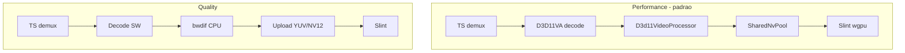

# Plano: Deinterlace Performance vs Quality

## Objetivo

Substituir o modelo implícito atual (`auto` = bwdif CPU + migração HW→SW) por dois perfis explícitos:

| Perfil | Backend | Decode | Zero-copy em 1080i |
|--------|---------|--------|-------------------|
| **Performance** (padrão) | `ID3D11VideoProcessor` | D3D11VA mantido | Sim |
| **Quality** | bwdif (libavfilter) | SW quando interlaced | Não |
| **Desligado** | nenhum | D3D11VA mantido | Sim (campos entrelaçados visíveis) |

**Controle exclusivamente no menu de contexto** — remover `[decoder] deinterlace` do [`ironstream.toml`](ironstream.toml) e de [`DecoderConfig`](src/config.rs). Padrão ao iniciar o app: **Performance**. O usuário alterna em runtime; a escolha vale só para a sessão (sem persistência em disco).

## Arquitetura alvo



A detecção de scan type existente em [`crates/av/src/scan_type.rs`](crates/av/src/scan_type.rs) continua igual; só muda **qual backend** roda quando `scan_type == Interlaced`.

## Fase 1 — Modelo de runtime (sem TOML)

### Remover do arquivo de config

- Apagar `DeinterlaceChoice` e o campo `deinterlace` de [`DecoderConfig`](src/config.rs) (~l.189–225)
- Remover mapeamento em [`src/main.rs`](src/main.rs) (~l.713–717) que lia `cfg.decoder.deinterlace`
- Remover/atualizar teste `spec_cfg_001_decoder_deinterlace_default_is_auto` em `config.rs`
- Documentar em comentário do TOML de exemplo (se existir) que deinterlace mudou para o menu de contexto

### Novo enum `DeinterlaceProfile` (só runtime)

Substituir `DeinterlaceMode` (`Auto`/`Force`/`Off`) em [`crates/av/src/codec.rs`](crates/av/src/codec.rs):

```rust
#[derive(Debug, Clone, Copy, PartialEq, Eq, Default)]
pub enum DeinterlaceProfile {
    #[default]
    Performance,  // D3D11 VP
    Quality,      // bwdif CPU
    Off,          // sem deinterlace (debug / zero-copy puro em 1080i)
}
```

- `Performance` e `Quality` em streams interlaced usam detecção automática via [`scan_type.rs`](crates/av/src/scan_type.rs) (SPS / field_order / flags) — equivalente ao antigo `Auto`
- `Quality` com streams mal marcados: manter `deint=all` quando `scan_type` já está fixado como `Interlaced` (comportamento herdado do antigo `Force`, mas sem opção separada no menu)
- `Off`: entrega frames entrelaçados sem processamento

**Default:** `DeinterlaceProfile::Performance` hardcoded no bootstrap da UI ([`lib.rs`](crates/ui-slint/src/lib.rs)), não no TOML.

### API runtime no decoder

Em [`crates/av/src/decoder.rs`](crates/av/src/decoder.rs):

```rust
pub fn set_deinterlace_profile(&mut self, profile: DeinterlaceProfile);
pub fn deinterlace_profile(&self) -> DeinterlaceProfile;
```

Ao trocar modo: `reset_with_hw_state()` (mesmo padrão de [`SetHwAccel`](src/main.rs) ~l.777), limpar `deinterlacer` e estado VP por PID.

## Fase 2 — D3D11 Video Processor (núcleo)

### Novo módulo `crates/av/src/hw/d3d11_vp.rs`

Responsabilidades (referência: VLC `d3d11_deinterlace.c`, mpv `vf_d3d11vpp.c`, GStreamer `d3d11deinterlace`):

1. Obter `ID3D11VideoDevice` / `ID3D11VideoContext` a partir de [`D3d11Device`](crates/av/src/hw/d3d11_impl.rs)
2. Criar `ID3D11VideoProcessorEnumerator` com `D3D11_VIDEO_PROCESSOR_CONTENT_DESC`:
   - `InputFrameFormat` = `INTERLACED_TOP_FIELD_FIRST` ou `BOTTOM` (de `AVFrame.top_field_first`)
   - `Usage` = `D3D11_VIDEO_USAGE_PLAYBACK_NORMAL`
3. Selecionar melhor `RateConversionCaps` disponível (preferência: adaptive+mocomp > bob > blend)
4. Por frame interlaced HW:
   - `ID3D11VideoDecoderOutputView` / input view do slice D3D11VA
   - Fila de referência past/future (mpv usa ~1–2 frames) para adaptive
   - `VideoProcessorBlt` → textura NV12 progressiva de saída
5. Reutilizar padrão de fence de [`shared_nv12.rs`](crates/av/src/hw/shared_nv12.rs) para handoff com `SharedNvImporter`

Exportar em [`crates/av/src/hw/mod.rs`](crates/av/src/hw/mod.rs).

### Integração no pipeline de decode

Alterar [`decoder.rs`](crates/av/src/decoder.rs):

| Local atual | Mudança |
|-------------|---------|
| `skip_hw_for_deinterlace` (~l.470) | Só pular HW em `DeinterlaceProfile::Quality` |
| Migração `reopen_sw_codec_from_hw` (~l.696, ~l.746) | Remover para Performance; manter só para Quality |
| `try_hw_zero_copy` / `build_hw_surface` (~l.1045) | Inserir passo VP **antes** de `SharedNvPool.acquire_copy` quando interlaced + Performance |
| Ramo SW + bwdif (~l.818) | Executar só em Quality |

Fluxo Performance:

```
receive_frame (D3D11) → D3d11Vp::process(texture, field_meta) → NV12 progressive → SharedNvPool → VideoFrame::Hw
```

### Contrato PTS (crítico — L-003)

- **Quality (bwdif):** manter [`rescale_bwdif_output_pts`](crates/av/src/ffi/mod.rs) (÷2) — invariante documentada em [`STATE.md`](.specs/project/STATE.md)
- **Performance (VP):** VP em modo adaptive/bob pode emitir 1 ou 2 frames por campo — definir e documentar:
  - **Recomendação inicial:** bob/adaptive com saída a **50p/59.94p** (2× taxa de campos), PTS = `field_pts + n * time_base/2` para alinhar com `AudioClock` 90 kHz
  - Validar contra stream GLOBO 1080i50 da baseline em [`perf-debug-1080i.md`](.specs/features/spec-11-slint/perf-debug-1080i.md)

### Fallback

Se VP falhar (caps ausentes, `VideoProcessorBlt` HRESULT, device sem video processor):

1. Log `tracing::warn!` com motivo
2. Fallback automático para Quality (bwdif SW) **naquele PID**
3. Métrica `deinterlace_reason = VpFallback`

Performance + `hwaccel = none` (CPU decode): VP não aplicável → fallback para Quality com aviso.

## Fase 3 — Abstração de backend

Refatorar [`crates/av/src/deinterlace.rs`](crates/av/src/deinterlace.rs) para trait interno:

```rust
enum DeinterlaceBackend {
    None,
    Bwdif(Deinterlacer),           // existente
    D3d11Vp(D3d11VideoProcessor),  // novo
}
```

O `FfmpegDecoder` escolhe o backend com base em `DeinterlaceProfile` + `scan_type` + disponibilidade HW.

Telemetria em [`crates/ts/src/metrics.rs`](crates/ts/src/metrics.rs):
- `deinterlacer_active` → label `"D3D11 VP"` ou `"bwdif"`
- Novo campo opcional `deinterlace_backend: String`

Painel PIPELINE em [`crates/ui-slint/src/lib.rs`](crates/ui-slint/src/lib.rs) (~l.1316): refletir backend ativo.

## Fase 4 — Menu de contexto Slint

Seguir o padrão existente de **Decodificação** ([`context_menu.rs`](crates/ui-slint/src/context_menu.rs) `build_decode`, [`appwindow.slint`](crates/ui-slint/ui/appwindow.slint) seção 5).

### Slint ([`appwindow.slint`](crates/ui-slint/ui/appwindow.slint))

- Nova propriedade `ctx-deinterlace: [MenuEntry]`
- Novo callback `set-deinterlace(int)`
- Nova `CtxRow { label: "Deinterlace"; ... }` com `ctx-section = 6` (após Proporção, antes de Decodificação)
- Handler `chosen`: `if (root.ctx-section == 6) { root.set-deinterlace(e.id); }`
- Ajustar layout: `cat-h`, `max-sub-reach`, `ctx-sub-y` (+1 linha)

### Rust UI

| Arquivo | Mudança |
|---------|---------|
| [`crates/ui-slint/src/state.rs`](crates/ui-slint/src/state.rs) | `DeinterlaceProfileChoice` + `AppCommand::SetDeinterlace { profile }` |
| [`context_menu.rs`](crates/ui-slint/src/context_menu.rs) | `build_deinterlace()` com IDs: `0 = Performance`, `1 = Quality`, `2 = Desligado` |
| [`lib.rs`](crates/ui-slint/src/lib.rs) | `on_set_deinterlace` → `cmd_tx`; default `Performance` no `Rc<RefCell<DeinterlaceProfileChoice>>` |
| [`src/table_dispatcher.rs`](src/table_dispatcher.rs) | `DecodeCommand::SetDeinterlace { profile }` |
| [`src/main.rs`](src/main.rs) | Handler no loop `av-decode`: `decoder.set_deinterlace_mode()` + `reset_with_hw_state()` |

Labels no menu (português, consistente com o resto):
- **Performance (GPU)** — padrão ao abrir o app
- **Qualidade (bwdif)**
- **Desligado** — substitui o antigo `deinterlace = off` do TOML; útil para debug de zero-copy em 1080i (campos visíveis, sem VP nem bwdif)

## Fase 5 — Testes e validação

### Testes unitários (`crates/av`)

- `spec_av_006_performance_skips_hw_migration` — interlaced + Performance não chama `reopen_sw_codec_from_hw`
- `spec_av_006_quality_migrates_to_sw` — interlaced + Quality migra para SW (regressão do comportamento atual)
- `spec_av_006_off_no_deinterlace` — Off não ativa nenhum backend
- `spec_ui_deinterlace_default_is_performance` — estado UI inicia em Performance sem TOML

Testes VP puros (sem GPU real): mock/stub ou `#[ignore]` com gate manual, seguindo padrão de [`hw/stub.rs`](crates/av/src/hw/stub.rs) para non-Windows.

### Checklist manual (atualizar [`perf-debug-1080i.md`](.specs/features/spec-11-slint/perf-debug-1080i.md))

Stream GLOBO 1080i H.264 via TSDuck, Intel Arc:

| Critério | Performance | Quality | Desligado |
|----------|-------------|---------|-----------|
| Decode | GPU (D3D11VA) | CPU | GPU (D3D11VA) |
| Deinterlace | D3D11 VP ativo | bwdif ativo | inativo |
| Zero-copy | `SharedNvImporter` ok | N/A (upload CPU) | `SharedNvImporter` ok |
| FPS vídeo 1400×900 | alvo >25 fps | baseline ~19–21 | baseline HW |
| Painel PIPELINE | `D3D11 VP Ativo` | `bwdif Ativo` | `Desligado` |

Troca via menu em runtime: alternar entre os três modos sem reconectar; decoder reseta e retoma em <2 s. Não é necessário editar `ironstream.toml`.

### Documentação

- Atualizar [`STATE.md`](.specs/project/STATE.md) L-007: HW→SW deixa de ser invariante em Performance
- Atualizar [`zero-copy-plan.md`](.specs/features/spec-11-slint/zero-copy-plan.md): zero-copy em 1080i via menu **Performance** ou **Desligado**
- Atualizar [`perf-debug-1080i.md`](.specs/features/spec-11-slint/perf-debug-1080i.md): remover referências a `deinterlace` no TOML; apontar para menu de contexto

## Ordem de implementação sugerida

1. **Config + enum + API `set_deinterlace_mode`** (sem VP ainda; Performance = "não migrar para SW", deinterlace off até VP pronto)
2. **`d3d11_vp.rs`** + integração em `try_hw_zero_copy`
3. **Remover migração HW→SW** condicionada ao perfil Performance
4. **Menu Slint + comando runtime**
5. **Telemetria, testes, docs**

## Riscos conhecidos

- **Qualidade VP depende do driver** (Intel Arc vs NVIDIA) — aceitável para monitoramento; Quality disponível no menu
- **PTS em VP** — maior risco de regressão A/V; validar antes de merge
- **Reference frames** — adaptive sem fila temporal degrada para bob; implementar fila desde o início
- **P010/HEVC 10-bit** — VP pode não suportar; fallback para Quality (já existe lógica HEVC chroma em `scan_type.rs`)

## Escopo fora deste plano

- Persistir escolha do menu em disco entre sessões (default sempre Performance no boot)
- Shader deinterlace no WGSL (rejeitado em [plan-cpuPipelineOptimization](.github/prompts/plan-cpuPipelineOptimization.prompt.md))
- `bwdif_cuda` / caminho NVIDIA dedicado
