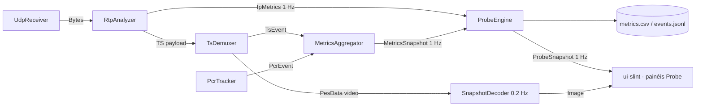

# Spec: Modo Probe — monitoração contínua sem player

- **Spec-IDs:** SPEC-PROBE-001 … SPEC-PROBE-026
- **Crates:** `crates/probe` (novo) · `crates/ui-slint` · `crates/net` · `crates/ts` · `src/main.rs`
- **Fase:** v0.4 — Probe (camada 1: IP → [spec-14-probe-ip](../spec-14-probe-ip/spec.md); camada 2: TS → spec-15, futura)
- **Origem:** `.notVersioned/Requisitos_Probe_MPEGTS_v0.4.docx` (recorte) + capturas de tela de uma probe comercial de referência (06/08/2026)

---

## 1. Contexto e objetivo

A operação usa hoje uma probe comercial de referência que monitora >400 canais
simultâneos a partir de um ponto fixo da rede. O equipamento é um servidor — não é transportável. Investigar um
problema em **outro** ponto de rede exigiria mover a probe, o que na prática não acontece.

O IronPlayer já recebe UDP/RTP multicast, demuxa TS, parseia PSI/SI e conta CC/CRC/PCR.
Falta transformar isso em **um instrumento que fica ligado sozinho por 12 h em um notebook
plugado no ponto de rede sob investigação, monitorando 1 ou 2 canais, e que ao final
responda uma pergunta objetiva: o stream nesse ponto está bom ou não?**

**Objetivo do modo Probe:** monitoração contínua, não assistida, de **até 2 feeds
simultâneos na mesma janela** (mosaico), com histórico persistido, gráficos e linha do
tempo de saúde, sem reprodução A/V contínua.

Os feeds sob investigação usam três encapsulamentos diferentes, e os três precisam
funcionar no mesmo mosaico: **UDP puro**, **RTP sem FEC** e **RTP com FEC** (portas
`base+2` e `base+4` — p.ex. 50002/50004 para um feed em 50000).

**Não-objetivo:** chegar ao nível da probe de referência. Esta spec cobre
deliberadamente um subconjunto (IP + TS) e descarta análise perceptual de vídeo/áudio, T-STD, HDR, loudness, logo, EPG,
SCTE-35, ABR e QoE score.

### 1.1 O que a probe de referência mostra e nós vamos reproduzir

| Tela de referência     | Elemento reproduzido no modo Probe                                  |
| ---------------------- | ------------------------------------------------------------------- |
| Summary (faixa colorida por hora) | Linha do tempo de saúde por bucket (SPEC-PROBE-009)      |
| IP Statistics          | Painel IP + gráficos jitter/inter-arrival ([spec-14](../spec-14-probe-ip/spec.md)) |
| Alerts (lista)         | Event log com severidade, ocorrências e contexto (SPEC-PROBE-008)   |
| Thumbnail de vídeo     | Snapshot 1 a cada 5 s, sem player (SPEC-PROBE-003)                   |
| Graphs                 | Séries temporais com rollup (SPEC-PROBE-005/010)                     |

---

## 2. Escopo

### 2.1 Dentro do escopo

- Seletor triplo de modo: **Cinema · Broadcast · Probe**.
- Mosaico de até 2 feeds simultâneos, cada um com pipeline e sessão independentes.
- Pipeline reduzido no modo Probe: rede + TS + checks, sem decode contínuo e sem áudio.
- Snapshot de vídeo periódico (thumbnail) com descarte do anterior.
- Motor de checks com perfil versionado, debounce/histerese e severidade.
- Sessão de monitoração com histórico persistido em disco (≥ 12 h).
- Linha do tempo de saúde, gráficos com redução de pontos, event log filtrável.
- Reconexão automática e registro de indisponibilidade.
- Exportação de relatório de sessão.

### 2.2 Fora do escopo (explícito)

Freeze/black frame, blockiness, loudness, true peak, silence, HDR, GOP length, detecção de
logo, T-STD, buffer analysis, erros de sintaxe de elementary stream (MPEG-2/H.264/HEVC),
EPG, SCTE-35, ABR, QoE score, agregador central, API remota, descriptografia/CA.

Fora do escopo **desta** spec, mas planejado como camada 2 (spec-15): promoção dos checks
TS (CC, CRC, PAT/PMT error, PCR error/accuracy, PID error, sync loss, mudanças de tabela)
a checks versionados com histórico. Os contadores já existem (`TsEvent`, `PcrEvent`,
`ErrorTracker`) — a camada 2 é sobretudo empacotamento, não parsing novo.

---

## 3. Modelo de operação

### 3.1 Os três modos

```rust
/// SPEC-PROBE-001
#[derive(Debug, Clone, Copy, PartialEq, Eq, Default, Serialize, Deserialize)]
pub enum AppMode {
    /// Vídeo em tela cheia, painéis ocultos.
    Cinema,
    /// Player + painéis de análise (comportamento atual).
    #[default]
    Broadcast,
    /// Monitoração contínua sem reprodução.
    Probe,
}
```

| Recurso                              | Cinema | Broadcast | Probe                    |
| ------------------------------------ | ------ | --------- | ------------------------ |
| Recepção UDP/RTP + demux TS          | sim    | sim       | sim                      |
| PSI/SI + tabelas                     | sim    | sim       | sim                      |
| Métricas 1 Hz (`MetricsSnapshot`)    | sim    | sim       | sim                      |
| Decode de vídeo contínuo             | sim    | sim       | **não**                  |
| Render loop de vídeo                 | sim    | sim       | **não** (thumbnail 0,2 Hz) |
| Áudio (WASAPI/cpal)                  | sim    | sim       | **não** — device não é aberto |
| hwaccel D3D11VA / D3D11 VP           | sim    | sim       | **não** (SW no thumbnail) |
| Motor de checks + histórico em disco | não    | opcional¹ | sim                      |
| Painéis laterais de análise          | ocultos| sim       | substituídos pelos painéis Probe |

¹ Em Broadcast o motor pode ser ligado por configuração (`[probe] enabled_in_broadcast`),
mas o default é `false` — modo Broadcast não deve pagar o custo de escrita em disco.

### 3.2 Estado atual da UI

O toggle Cinema/Broadcast em [`appwindow.slint:957`](../../../crates/ui-slint/ui/appwindow.slint)
é hoje **estático** — dois retângulos sem `TouchArea`, sem callback e sem propriedade de
estado. Não existe `AppMode` no Rust. Portanto SPEC-PROBE-001 não é "adicionar um terceiro
botão": é criar o conceito de modo (Rust + Slint + persistência) e ligar os três.

---

## 4. Requisitos funcionais

| ID              | Requisito                                                                                                       | Critério de aceite                                                                                                       |
| --------------- | --------------------------------------------------------------------------------------------------------------- | ------------------------------------------------------------------------------------------------------------------------ |
| SPEC-PROBE-001  | Seletor triplo Cinema/Broadcast/Probe na barra superior, com `AppMode` em Rust e callback `set-mode(int)`         | Clique alterna o modo; modo ativo destacado; valor persiste em `[ui] mode` do `ironstream.toml` e é restaurado no start   |
| SPEC-PROBE-002  | Em modo Probe o pipeline A/V não é instanciado: sem `FfmpegDecoder` contínuo, sem `AudioOutput`, sem `VideoQueue` | Nenhum device de áudio aberto (verificável no Gerenciador de Som); CPU do processo < 25 % com **dois** feeds de 15 Mbps num Core i5 de notebook |
| SPEC-PROBE-003  | Snapshot de vídeo a cada `snapshot_interval_secs` (default 5 s), decodificado em SW, escalado para ≤ 320×180      | Somente 1 imagem viva por feed; a anterior é liberada ao publicar a nova; nenhum frame extra é decodificado entre ticks   |
| SPEC-PROBE-003a | O snapshot arma o decoder no máximo `arm_window_secs` (default 2,5 s) antes do tick e desarma após 1 frame        | Sem IRAP na janela → `snapshot_state = "sem keyframe"`; não gera alarme por si só                                        |
| SPEC-PROBE-003b | Com 2 feeds, os ticks de snapshot são escalonados (offset = `interval / n_feeds`)                                | Dois decodes SW nunca coincidem no mesmo instante; verificável por log de timestamps                                     |
| SPEC-PROBE-004  | Sessão de monitoração **por feed**, com `session_id`, `run_id`, `feed_slot`, início/fim, feed, host, interface, versões | Iniciar Probe cria uma pasta de sessão por feed sob o mesmo `run_id`; parar/fechar grava o resumo de cada uma            |
| SPEC-PROBE-005  | Série temporal amostrada a 1 Hz + rollup de 60 s (min/avg/max/count) mantido em memória                           | 12 h de sessão ⇒ 720 buckets de 60 s em RAM; consumo do rollup < 2 MB                                                    |
| SPEC-PROBE-006  | Persistência append-only em disco: `metrics.csv` (1 Hz) e `events.jsonl`                                         | Matar o processo com `taskkill /f` perde no máximo `flush_interval_secs` (default 5 s) de amostras; arquivo permanece legível |
| SPEC-PROBE-007  | Motor de checks com perfil versionado: limiar, janela, duração mínima, histerese e severidade externos ao binário | Alterar limiar no TOML muda o resultado sem recompilar; o evento carrega `profile_version`                                |
| SPEC-PROBE-008  | Event log com abertura/atualização/fechamento, deduplicação e contagem agregada                                  | 1000 CC errors contínuos no mesmo PID ⇒ 1 evento com `count = 1000`, não 1000 eventos                                     |
| SPEC-PROBE-009  | Linha do tempo de saúde por bucket (default 5 min): pior severidade do bucket ⇒ cor                              | 12 h ⇒ 144 células; célula sem dado é cinza (distinta de verde); clique na célula filtra o event log daquele intervalo    |
| SPEC-PROBE-010  | Gráficos de sessão: bitrate total, PDV/inter-arrival, perda RTP/s, CC errors/s, CRC errors/s                      | Cada gráfico aceita janela 5 min / 1 h / 12 h / sessão inteira e nunca desenha mais de 1000 pontos                        |
| SPEC-PROBE-011  | Reconexão automática ao perder o feed, com backoff, e registro do período de indisponibilidade                    | Cabo removido por 30 s ⇒ 1 evento `feed_unavailable` com duração ≈ 30 s e retomada automática, sessão preservada          |
| SPEC-PROBE-012  | Enquanto a sessão está ativa, o Windows não suspende nem desliga a tela                                           | `SetThreadExecutionState(ES_CONTINUOUS \| ES_SYSTEM_REQUIRED)` ativo; liberado ao parar a sessão                          |
| SPEC-PROBE-013  | Autodiagnóstico: descartes locais (canal cheio, socket) e jitter de agendamento do próprio tick são medidos       | Painel "Saúde da probe" mostra `local_drops`, `sched_jitter_ms`; eventos de perda com descarte local no mesmo segundo são marcados `origin = local` |
| SPEC-PROBE-014  | Exportação de relatório de sessão em HTML autocontido + CSV bruto                                                | Um arquivo `.html` abre no navegador sem rede, com resumo, timeline, gráficos e top-10 eventos                            |
| SPEC-PROBE-015  | Seção `[probe]` no `ironstream.toml`, com `profile_version` e defaults gerados na ausência do arquivo             | Arquivo ausente ⇒ seção escrita com defaults documentados                                                                |
| SPEC-PROBE-016  | Retenção: sessões antigas removidas por idade (`retention_days`, default 14) ou por tamanho total (`max_disk_mb`) | Rotação nunca apaga a sessão em curso; remoção é logada                                                                  |

### 4.1 Mosaico de feeds

| ID              | Requisito                                                                                                                        | Critério de aceite                                                                                                     |
| --------------- | -------------------------------------------------------------------------------------------------------------------------------- | ----------------------------------------------------------------------------------------------------------------------- |
| SPEC-PROBE-017  | Até `MAX_FEEDS` (= 2 nesta versão) pipelines **independentes**: socket, demux, métricas, motor de checks e sessão próprios        | Feed 1 caindo não interrompe nem zera contadores do feed 0; verificável derrubando um dos dois                          |
| SPEC-PROBE-017a | `MAX_FEEDS` é uma constante única; nada no código assume "exatamente 2" (índices, nomes de thread e de canal derivam do slot)     | Elevar a constante para 4 compila e roda sem outras alterações estruturais                                              |
| SPEC-PROBE-018  | Cada feed vira um **tile** no mosaico com: thumbnail, nome, badges de encapsulamento, indicadores de estado, disponibilidade %    | Layout do tile conforme §8.1; tiles em grade que reflui com a largura da janela                                          |
| SPEC-PROBE-018a | Os três encapsulamentos (UDP puro · RTP · RTP+FEC) convivem no mesmo mosaico, cada tile mostrando o seu                           | Badge `UDP` / `RTP` / `RTP+FEC` correto por tile; checks inaplicáveis do tile ficam `n/a`, não verdes                    |
| SPEC-PROBE-019  | Clicar num tile abre o **detalhe** daquele feed (timeline, gráficos, event log) sem parar a coleta do outro                       | Alternar entre detalhes não gera buraco no `metrics.csv` de nenhum dos dois                                              |
| SPEC-PROBE-020  | O relatório de sessão cobre o `run_id` inteiro: resumo lado a lado dos 2 feeds + seções individuais                               | Um HTML com as duas timelines alinhadas no mesmo eixo de tempo                                                           |

Escalonar para 4+ feeds é explicitamente **não-objetivo agora** — mas SPEC-PROBE-017a
existe para que subir o limite depois seja mudar uma constante, não refatorar o wiring.

### 4.1a Serviços do multiplex e navegação em quatro níveis

A primeira versão media o **multiplex inteiro**: um feed, um conjunto de contadores, uma
faixa de saúde. Num MPTS isso responde "o transporte está bom?", mas não "**qual serviço**
está ruim?" — que é a pergunta que o operador faz olhando o mosaico. Os requisitos abaixo
fecham essa lacuna, e são a razão de o modo Probe ter quatro níveis em vez de dois.

| ID              | Requisito                                                                                                                              | Critério de aceite                                                                                                                    |
| --------------- | --------------------------------------------------------------------------------------------------------------------------------------- | --------------------------------------------------------------------------------------------------------------------------------------- |
| SPEC-PROBE-021  | Inventário de serviços por feed a partir de PAT/PMT/SDT: `service_id`, nome, provedor, PMT PID, PCR PID, CA e os elementary streams com tipo, codec e idioma | Serviço que sai da PAT sai do inventário no tick seguinte; PID pertence a **um** serviço só (o primeiro que o lista)                    |
| SPEC-PROBE-021a | Toda ocorrência com PID conhecido carrega também o `service_id` dono dele; CRC e PCR passam a ser atribuídos por PID, não só como total | Um CC error no PID de um serviço abre alarme naquele serviço e **não** no vizinho do mesmo multiplex                                    |
| SPEC-PROBE-021b | Evento crítico sem PID nem serviço (feed indisponível, sync loss) atinge todos os serviços                                              | Cabo removido ⇒ toda linha de serviço fica crítica junto com a de transporte, nunca verde                                              |
| SPEC-PROBE-022  | Nível 1 (feed) com abas **Resumo** (visão MPTS) e **Serviços** (mosaico de serviços do multiplex)                                       | A aba Serviços mostra um tile por serviço com thumbnail, badges, indicadores `TS/V/A`, disponibilidade e nome; contagem na própria aba  |
| SPEC-PROBE-022a | Indicadores do tile de serviço refletem só os eventos daquele serviço; camada ausente fica `n/a`                                        | Serviço só de áudio mostra `V` cinza, nunca verde (mesma regra do SPEC-PROBE-018a)                                                     |
| SPEC-PROBE-023  | Grade de saúde por cluster de tempo: uma **linha por escopo** (transporte, IP/RTP, cada serviço, cada PID) sobre um eixo de tempo único | 12 h ⇒ 144 colunas de 5 min; escopo que nasceu depois tem célula cinza antes de existir, nunca verde                                    |
| SPEC-PROBE-023a | A grade cresce com a sessão e satura em 12 h (144 colunas), com piso de 24 colunas; o seletor de janela governa os gráficos, não ela    | Sessão de 3 min ⇒ 24 colunas (contexto, não 143 cinzas); de 3 h ⇒ 36; de 24 h ⇒ as 12 h finais. Trocar a janela não muda a grade        |
| SPEC-PROBE-023b | Toda linha do tempo de escopo tem teto de células em memória                                                                            | Sessão de 24 h num MPTS de 10 serviços mantém RSS estável (RNF-PRB-001)                                                                |
| SPEC-PROBE-024  | Thumbnail é **por serviço**: o round-robin percorre `(feed, serviço com vídeo)`; o tile do feed mostra o do serviço primário            | Num MPTS de N serviços cada um é atualizado a cada `N × stagger`; o custo de CPU por captura não muda (SPEC-PROBE-002)                 |
| SPEC-PROBE-025  | Clicar numa célula da grade abre a lista consolidada dos problemas daquela janela, filtrada pelo escopo da linha                        | A lista traz nível, hora, descrição por extenso, ocorrências agregadas, serviço e PID; `Fechar` volta sem perder a seleção da célula   |
| SPEC-PROBE-025a | A descrição do alerta se explica sozinha, com a referência normativa quando existe                                                      | Um `cc_error` vira "TR 101 290 P1.4 Continuity Counter Error: N descontinuidades no PID X", não o `check_id` cru                        |
| SPEC-PROBE-026  | A barra de endereço (protocolo, URL, Conectar, Desconectar) fica **oculta** em modo Probe                                               | Os feeds vêm de `[[probe.feeds]]`; nenhum controle de conexão manual aparece na barra superior quando `mode = probe`                    |

**Por que o thumbnail por serviço dilui a cadência.** O decoder de snapshot é único e
sequencial (§5.4). Manter a cadência de 5 s por serviço num MPTS de 8 serviços exigiria
oito armações de 2,5 s dentro de cada janela de 5 s — o decoder ficaria ocupado
praticamente o tempo todo, e o orçamento de CPU do SPEC-PROBE-002 (< 25 % com dois feeds)
iria embora. A troca deliberada é: **custo por captura constante, cadência por serviço
proporcional ao número de serviços**.

### 4.2 Requisitos de degradação (RNF operacional)

| ID              | Requisito                                                                                       | Critério de aceite                                                        |
| --------------- | ----------------------------------------------------------------------------------------------- | ------------------------------------------------------------------------- |
| SPEC-PROBE-013a | Sob sobrecarga, a probe degrada nesta ordem: 1) thumbnail, 2) rollups de UI, 3) séries secundárias | A recepção UDP e a contagem de perda/CC nunca são as primeiras a degradar |
| SPEC-PROBE-013b | A degradação é registrada como evento informativo, não silenciosa                                | Evento `probe_degraded` com o estágio acionado                            |

---

## 5. Arquitetura

### 5.1 Crate novo `crates/probe`

Direção de dependências (mantém a regra do [AGENTS.md](../../../AGENTS.md)):

```
probe → ts, net        (nunca o inverso)
ui-slint → probe, ts, av, net
av → ts
```

`crates/probe` concentra: motor de checks, estado de alarmes, séries temporais, escrita em
disco e exportação. Não parseia TS nem toca em socket — consome as APIs públicas de `ts`
e `net`.

> **Colisão de nomes:** já existe `ts::mediainfo::StreamProbe` e o exemplo
> `crates/av/examples/vp_probe.rs`. Os tipos novos usam o prefixo `Probe*`
> (`ProbeEngine`, `ProbeSession`, `ProbeEvent`) para evitar ambiguidade em `use`.

### 5.2 `FeedPipeline` — a mudança estrutural desta spec

Hoje [`src/channels.rs`](../../../src/channels.rs) cria **um** conjunto global de canais e
[`src/main.rs`](../../../src/main.rs) monta **um** pipeline. Suportar 2 feeds exige extrair
esse conjunto para uma unidade replicável:

```rust
/// SPEC-PROBE-017 — tudo que hoje é global vira campo de slot.
pub const MAX_FEEDS: usize = 2;

pub struct FeedPipeline {
    pub slot: usize,              // 0..MAX_FEEDS
    pub url: StreamUrl,
    pub channels: AppChannels,    // já existe — passa a ser por feed
    pub snapshot_rx: SnapshotReceiver,
    pub ip_metrics_rx: IpMetricsReceiver,
    pub session: ProbeSession,
    pub guard: PipelineGuard,     // já existe — encerramento em cascata por feed
}
```

Regras:

- Nomes de thread e de canal recebem sufixo de slot (`net-recv-0`, `ts_raw-1`) — o
  `BoundedSender` já loga por nome; sem o sufixo, dois feeds saturando ficam
  indistinguíveis no log.
- `PipelineGuard` (que já implementa o encerramento em cascata) passa a ser **por feed**:
  parar o feed 1 não pode fechar o `net_raw` do feed 0.
- Em modo Cinema/Broadcast só o slot 0 é instanciado — nenhuma regressão no player.
- Cada feed faz seu próprio `join` multicast. Dois feeds no **mesmo** grupo/porta são
  rejeitados na validação de configuração (seria duplicar tráfego sem ganho).

### 5.3 Fluxo de dados (por feed)



**Decisão de projeto:** o `ProbeEngine` **amostra contadores acumulados**, não faz tee de
eventos brutos. `ErrorSnapshot` já expõe `cc_errors` por PID, `crc_errors` por
`(pid, table_id)`, `sync_losses`, `rtp_out_of_order` e `udp_overflows` de forma cumulativa
— a probe deriva o delta por segundo. Isso evita duplicar canais e mantém a regra de
"não duplicar métrica existente".

Eventos discretos que **não** cabem em contador (mudança de PAT/PMT, mudança de SSRC,
mudança de IP de origem, mudança de codec) chegam por um canal bounded dedicado
`probe_events` (cap. 1024, política: descarta o mais novo + incrementa `dropped_events`).

### 5.4 Threads

| Thread              | Instâncias   | Papel                                                                 | Prioridade      |
| ------------------- | ------------ | --------------------------------------------------------------------- | --------------- |
| `net-recv-{slot}`   | 1 por feed   | existente — `recv_from` + timestamp de chegada                        | acima do normal |
| `net-fec-{slot}`    | 0–2 por feed | recepção das portas FEC `base+2` / `base+4`, só quando há FEC          | normal          |
| `probe-engine-{slot}`| 1 por feed  | tick 1 Hz: amostra, avalia checks, atualiza séries, enfileira escrita | normal          |
| `probe-writer`      | **1 global** | drena a fila de todos os feeds, `BufWriter` por arquivo, flush a 5 s   | abaixo do normal |
| `probe-snapshot`    | **1 global** | percorre os feeds em round-robin armando o decoder SW                 | abaixo do normal |

Writer e snapshot são **globais de propósito**: um writer por feed dobraria o I/O
concorrente num disco de notebook, e um decoder por feed derrubaria a garantia de
SPEC-PROBE-003b (decodes escalonados). Com `MAX_FEEDS = 2` e ticks de 5 s, um decoder
round-robin sobra folga.

O `probe-engine` **nunca** faz I/O de disco no próprio tick — só enfileira. Escrita lenta
(disco de notebook, antivírus) não pode atrasar a amostragem.

### 5.5 Troca de modo em runtime

Trocar de/para Probe reconfigura o pipeline A/V do slot 0 e liga/desliga os slots extras —
a recepção do slot 0 nunca é reiniciada:

1. **→ Probe:** emite `TableEvent::ResetVideo` no slot 0 (nunca `Reset` — ver L-010 no
   [STATE.md](../../project/STATE.md)), encerra decoder/áudio, mantém socket + demux;
   instancia os demais slots de `[[probe.feeds]]`; abre o run e uma sessão por feed.
2. **Probe →:** encerra os slots ≥ 1, instancia decoder/áudio no slot 0, fecha o run
   (fecha arquivos e grava o resumo de cada sessão).

O run **não** sobrevive à troca de modo nem à troca de feed — cada uma abre um run novo.
Sobrevive a reconexão dos mesmos feeds (SPEC-PROBE-011).

---

## 6. Formato dos dados em disco

Raiz: `<pasta do executável>/probe-sessions/` (mesma pasta do `ironstream.toml`, mantém a
portabilidade "copiar a pasta para o notebook").

Uma pasta por **run** (a sessão de monitoração como um todo) e uma subpasta por **feed** —
é o que permite o relatório comparativo do SPEC-PROBE-020 sem correlacionar arquivos soltos:

```
probe-sessions/
└── 2026-08-07T09-15-32_run/
    ├── run.toml              run_id, início/fim, host, versão do app, perfil, lista de feeds
    ├── report.html           relatório do run inteiro, 2 feeds lado a lado (SPEC-PROBE-014/020)
    ├── feed-0_239.15.0.183-50000/
    │   ├── session.toml      feed, slot, encapsulamento detectado, iface, SO_RCVBUF efetivo,
    │   │                     noise_floor_us, csv_schema_version, resumo final
    │   ├── metrics.csv       1 linha/s
    │   └── events.jsonl      1 linha/evento (abertura, atualização, fechamento)
    └── feed-1_239.15.0.190-50000/
        └── …
```

O nome da pasta do feed usa `grupo-porta` — legível e único dentro do run (SPEC-PROBE-017
proíbe dois feeds no mesmo grupo/porta).

### 6.1 `metrics.csv` — colunas mínimas da camada base

CSV foi escolhido de propósito: 12 h × 1 Hz = 43 200 linhas ≈ 9 MB, abre direto no Excel,
que é onde a análise pós-monitoração de fato acontece.

```
ts_utc,uptime_s,connected,bitrate_kbps,null_ratio,
cc_errors_delta,crc_errors_delta,sync_loss_delta,pcr_jitter_delta,pcr_disc_delta,
local_drops_delta,sched_jitter_ms,worst_severity
```

As colunas da camada IP (RTP/FEC/jitter/inter-arrival) são definidas em
[spec-14-probe-ip §6](../spec-14-probe-ip/spec.md#6-persistência-da-camada-ip) e anexadas
à mesma linha. A ordem das colunas é fixa e versionada por `csv_schema_version` em
`session.toml`.

### 6.2 `events.jsonl`

Um objeto por linha (`serde_json`; adicionar `serde_json = "1"` às deps do workspace —
já presente no `Cargo.lock` de forma transitiva):

```json
{"event_id":"01J...","check_id":"rtp_missing","phase":"open","severity":"error",
 "ts_utc":"2026-08-07T13:55:07.555Z","first_seen":"...","last_seen":"...",
 "count":130,"duration_ms":0,"measured":130.0,"threshold":0.0,"unit":"pkts",
 "context":{"pid":null,"service_id":null,"ssrc":"0x1A2B3C4D","origin":"network"},
 "profile_version":1}
```

`phase ∈ {open, update, close}`. Regra de deduplicação: a mesma
`(check_id, context)` só abre um evento; enquanto ativo, recebe `update` a cada
`summary_interval_secs` (default 60 s) com a contagem agregada.

---

## 7. Modelo de check e severidade

```rust
/// SPEC-PROBE-007
pub struct CheckDef {
    pub id: &'static str,
    pub layer: Layer,            // Ip | Ts
    pub threshold: f64,
    pub unit: &'static str,
    pub window: Duration,        // janela de avaliação
    pub min_duration: Duration,  // debounce de abertura
    pub clear_duration: Duration,// histerese de fechamento
    pub severity: Severity,      // Critical | Error | Warning | Info
    pub enabled: bool,
}
```

Política inicial de severidade (ajustável por perfil):

| Categoria                                              | Severidade default |
| ------------------------------------------------------ | ------------------ |
| Feed indisponível, TS sync loss, PAT/PMT ausente        | Critical           |
| Perda RTP, CC error, CRC error, PCR error               | Error              |
| Jitter/inter-arrival fora do perfil, reorder, duplicata | Warning            |
| Mudança de PAT/PMT/codec/SSRC/IP de origem              | Info               |

**Antirruído obrigatório:** dedupe por `(check_id, context)`; debounce de abertura
(`min_duration`) e de fechamento (`clear_duration`); resumo periódico em vez de evento por
pacote. Sem isso, 12 h de sessão num stream ruim geram um log inútil.

---

## 8. UI do modo Probe

Quatro níveis. O mosaico de feeds é a tela inicial; cada clique desce um nível e a trilha
de navegação no topo sobe de volta.

| Nível | Tela                                   | O que responde                                  |
| ----- | -------------------------------------- | ----------------------------------------------- |
| 0     | mosaico de **feeds**                   | qual ponto de rede está com problema             |
| 1     | feed · abas **Resumo** e **Serviços**  | o transporte está bom? qual serviço está ruim?   |
| 2     | **serviço**                            | o que neste canal está ruim, e em qual PID       |
| 3     | **alertas da janela** (overlay)        | o que exatamente aconteceu naquele intervalo     |

Não há barra de endereço em modo Probe (SPEC-PROBE-026): os feeds vêm de
`[[probe.feeds]]`, e um campo de URL que não conecta nada seria um controle morto na tela.

### 8.1 Mosaico e anatomia do tile

```
┌───────────────────────────────────────────────────────────────────────┐
│ [Cinema][Broadcast][ PROBE ]        run 03:34:21   ⏺ gravando  [parar]│
├───────────────────────────┬───────────────────────────┬───────────────┤
│ ┌───────────────────────┐ │ ┌───────────────────────┐ │               │
│ │ RTP+FEC   HD   SCR    │ │ │ UDP       HD          │ │   (slot livre │
│ │ ┌───────────────────┐ │ │ │ ┌───────────────────┐ │ │    até        │
│ │ │   thumbnail 5 s   │ │ │ │ │   thumbnail 5 s   │ │ │    MAX_FEEDS) │
│ │ │      320×180      │ │ │ │ │      320×180      │ │ │               │
│ │ └───────────────────┘ │ │ │ └───────────────────┘ │ │               │
│ │  IP   RTP   TS   V  A │ │ │  IP    —    TS   V  A │ │               │
│ │  ▇▇▇▇▇▇▇▇▇▇▇▇▇  99,4 %│ │ │  ▇▇▇▇▇▇▇▇▇▇▇▇▇ 100 %  │ │               │
│ │  0084_CANAL_A         │ │ │  0116_CANAL_B         │ │               │
│ └───────────────────────┘ │ └───────────────────────┘ │               │
└───────────────────────────┴───────────────────────────┴───────────────┘
```

| Elemento do tile        | Fonte                                                                                   |
| ----------------------- | ---------------------------------------------------------------------------------------- |
| Badges de encapsulamento| `UDP` · `RTP` · `RTP+FEC`, detectado em runtime (SPEC-PROBE-018a)                          |
| Badges de conteúdo      | `HD`/`SD` (resolução do vídeo), `SCR` (scrambling_control ≠ 0) — apenas presença           |
| Thumbnail               | SPEC-PROBE-003, um por feed, escalonado                                                    |
| Indicadores redondos    | `IP` `RTP` `TS` `V` `A` — verde/amarelo/vermelho/cinza(n/a) pelo pior check da camada      |
| Barra + %               | disponibilidade da janela corrente (default últimos 60 min), não "qualidade" subjetiva     |
| Nome                    | `[[probe.feeds]] name`, ou `grupo:porta` se não houver nome                                |

**Sem VU meter de áudio.** O mosaico de referência mostra nível de áudio por canal; isso
exige decodificar áudio continuamente, que é exatamente o que o modo Probe não faz. O
indicador `A` reflete **presença e bitrate do PID de áudio**, não nível — e a spec diz isso
na ajuda contextual para não induzir o operador ao erro.

### 8.2 Nível 1 — feed (abas Resumo e Serviços)

```
┌───────────────────────────────────────────────────────────────────────┐
│ ← voltar  Feeds › 0084_CANAL_A  udp://@239.15.0.183:50000 RTP+FEC ●   │
│ [ Resumo ][ Serviços (8) ]                                            │
├────────────────┬──────────────────────────────────────────────────────┤
│ thumbnail 5 s  │ GRADE DE SAÚDE (144 colunas · 5 min)                 │
│ 320×180        │ TRANSPORTE ▇▇▇▇▇▇▇▇▇▇▇▇▇▇▇▇▇▇▇▇▇▇▇▇▇▇▇▇▇▇▇▇▇▇▇▇▇▇   │
│                │ IP / RTP   ▇▇▇▇▇▇▇▇▇▇▇▇▇▇▇▇▇▇▇▇▇▇▇▇▇▇▇▇▇▇▇▇▇▇▇▇▇▇   │
│ RESUMO         │ 0055_BIS   ▇▇▇▇▇▇▇▇▇▇▇▇▇▇▇▇▇▇▇▇▇▇▇▇▇▇▇▇▇▇▇▇▇▇▇▇▇▇   │
│ uptime         ├──────────────────────────────────────────────────────┤
│ disponibilidade│ Bitrate ─────────────  CC errors/s ────────────────  │
│ serviços       ├──────────────────────────────────────────────────────┤
│ pior evento    │ EVENT LOG  [filtro: severidade]                     │
│ saúde da probe │ 13:55:07 Error cc_error ×130  pid 6100 · svc 55     │
└────────────────┴──────────────────────────────────────────────────────┘
```

A aba **Serviços** substitui a área central por um segundo mosaico, um tile por serviço do
multiplex (SPEC-PROBE-022), com a mesma anatomia do tile de feed menos os indicadores de
rede — um serviço não tem camada IP própria, o datagrama é do feed inteiro.

### 8.3 Nível 2 — serviço, e a grade de saúde

```
┌───────────────────────────────────────────────────────────────────────┐
│ ← voltar  Feeds › 0084_CANAL_A › 0055_BIS_PRIMARY        ● 99,4 %     │
├────────────────┬──────────────────────────────────────────────────────┤
│ thumbnail      │      11:30   12:00   12:30   13:00   13:30   14:00   │
│ TS  V  A       │ 0055_BIS   ▇▇▇▇▇▇▇▇▇▇▇▇▇▇▇▇▇▇▇▇▇▇▇▇▇▇▇▇▇▇▇▇▇▇▇▇▇▇   │
│                │ H.264 (6100)▇▇▇▇▇▇▇▇▇▇▇▇▇▇▇▇▇▇▇▇▇▇▇▇▇▇▇▇▇▇▇▇▇▇▇▇▇   │
│ RESUMO         │ AC-3·por(6102)▇▇▇▇▇▇▇▇▇▇▇▇▇▇▇▇▇▇▇▇▇▇▇▇▇▇▇▇▇▇▇▇▇▇▇   │
│ service id     │ MP2·eng(6108)▇▇▇▇▇▇▇▇▇▇▇▇▇▇▇▇▇▇▇▇▇▇▇▇▇▇▇▇▇▇▇▇▇▇▇▇   │
│ share do mux   ├──────────────────────────────────────────────────────┤
│ PIDS DO SERVIÇO│ EVENT LOG (só deste serviço)                        │
└────────────────┴──────────────────────────────────────────────────────┘
```

- A grade é o artefato-chave: depois de 12 h, é ela que responde "o stream está bom?"
  antes de qualquer gráfico — e agora diz **onde**, não só *se*.
- Todas as linhas compartilham um eixo de tempo único, derivado do relógio e não do índice
  do vetor: um serviço que só apareceu na PAT depois de uma hora tem menos células, e
  alinhar por índice deslocaria a coluna inteira. O que não existe fica cinza — "sem dado",
  distinto de verde (SPEC-PROBE-009).
- Clicar numa célula abre o nível 3 (SPEC-PROBE-025).

### 8.4 Nível 3 — alertas da janela

Overlay com a lista consolidada dos problemas daquela célula, filtrada pelo escopo da
linha clicada: `#`, nível, hora, descrição por extenso, ocorrências agregadas, serviço e
PID. Ordenada por severidade e, dentro dela, pelo mais recente.

### 8.5 Notas de implementação da UI

- Gráficos reusam `line_path`/`area_path` de
  [`crates/ui-slint/src/lib.rs:1290`](../../../crates/ui-slint/src/lib.rs) com `Path` do
  Slint — nenhum widget de chart novo.
- **Redução de pontos obrigatória:** a UI desenha buckets do rollup, nunca a série 1 Hz
  crua. Ver L-007 no [STATE.md](../../project/STATE.md) — o femtovg já é o gargalo de
  render; 43 200 pontos por gráfico travariam a janela.
- Repintura dos painéis Probe: ≤ 1 Hz, com `cache-rendering-hint: true`.
- **Uma `TouchArea` para a grade inteira**, com linha/coluna derivadas da posição do
  clique. Com 12 linhas × 144 colunas seriam ~1700 `TouchArea` com estado de hover próprio,
  pelo mesmo motivo do L-007.
- As células da grade chegam num modelo **plano** com `row`/`col` e posicionamento
  absoluto, não num array aninhado por linha: array dentro de struct complica o mapeamento
  no Rust e o posicionamento absoluto já é o padrão do mosaico e dos gráficos.

---

## 9. Configuração (`[probe]` no `ironstream.toml`)

```toml
[probe]
profile_version         = 1
max_feeds               = 2      # SPEC-PROBE-017 — limite desta versão
snapshot_interval_secs  = 5      # SPEC-PROBE-003
snapshot_arm_secs       = 2.5
snapshot_max_width      = 320
save_snapshot_on_error  = false  # evidência opcional; respeita "descarta o anterior"
sample_interval_ms      = 1000   # SPEC-PROBE-005
rollup_secs             = 60
timeline_bucket_secs    = 300    # SPEC-PROBE-009
flush_interval_secs     = 5      # SPEC-PROBE-006
summary_interval_secs   = 60     # SPEC-PROBE-008
reconnect_backoff_ms    = [1000, 2000, 5000, 10000, 30000]  # SPEC-PROBE-011
prevent_sleep           = true   # SPEC-PROBE-012
retention_days          = 14     # SPEC-PROBE-016
max_disk_mb             = 4096
enabled_in_broadcast    = false

# Um bloco por feed do mosaico, na ordem dos slots (máx. `max_feeds`).
[[probe.feeds]]
name = "0084_CANAL_A"
url  = "rtp://@239.15.0.183:50000"
fec  = "auto"          # auto detecta em base+2 / base+4 → 50002 / 50004

[[probe.feeds]]
name = "0116_CANAL_B"
url  = "udp://@239.15.0.190:50000"
fec  = "off"           # UDP puro: checks de RTP/FEC ficam n/a
```

Limiares por check ficam em `[probe.checks.<id>]` — definidos por camada nas specs
correspondentes. `[[probe.feeds]]` é aditivo: um arquivo sem a seção mantém o
comportamento atual de feed único vindo da barra de URL.

---

## 10. Requisitos não funcionais

| ID          | Atributo         | Requisito                                                                                    |
| ----------- | ---------------- | -------------------------------------------------------------------------------------------- |
| RNF-PRB-001 | Autonomia        | 12 h ininterruptas sem intervenção, sem crescimento de memória (RSS estável após 1 h)         |
| RNF-PRB-002 | Precisão temporal| `Instant` (QPC) para intervalos; relógio de parede só nos timestamps exportados                |
| RNF-PRB-003 | Resiliência      | Nenhum panic em dado externo; seção/pacote inválido é isolado e contabilizado                  |
| RNF-PRB-004 | Recursos         | Todos os canais bounded; descarte contabilizado, nunca silencioso                              |
| RNF-PRB-005 | Disco            | Escrita ≤ 1 MB/min por sessão; rotação automática                                              |
| RNF-PRB-006 | Não regressão    | Com `mode != Probe` o comportamento atual de player é idêntico ao da baseline                  |
| RNF-PRB-007 | Testabilidade    | Motor de checks aceita fixtures determinísticas (relógio injetável), sem depender de rede real |

---

## 11. Critérios de aceite da fase

1. O seletor triplo funciona e o modo persiste entre execuções.
2. Em modo Probe, nenhum device de áudio é aberto e nenhum frame é renderizado além do
   thumbnail de 5 s.
3. Uma sessão de 12 h em stream real termina com `metrics.csv` completo, sem buracos além
   dos períodos de indisponibilidade registrados.
4. Retirar o cabo por 30 s gera exatamente um evento de indisponibilidade com duração
   correta e a sessão retoma sozinha.
5. A linha do tempo mostra as janelas com erro nas posições corretas quando comparada ao
   `events.jsonl`.
6. O relatório HTML abre sem rede e traz resumo, timeline e top-10 eventos dos 2 feeds.
7. Com `mode = Broadcast`, os testes de regressão existentes passam sem alteração.
8. Dois feeds simultâneos — um RTP+FEC e um UDP puro — rodam 12 h no mosaico; derrubar um
   não afeta contadores, sessão nem arquivos do outro.
9. Elevar `MAX_FEEDS` de 2 para 4 compila sem alterar wiring (SPEC-PROBE-017a).
10. `cargo test -p probe` verde e `cargo clippy --workspace -- -D warnings` limpo.
11. Num MPTS real, a aba Serviços lista todos os serviços da PAT, com nome da SDT.
12. Um CC error injetado no PID de um serviço acende aquele serviço e o PID correspondente
    na grade, e deixa os vizinhos verdes (SPEC-PROBE-021a).
13. Clicar numa célula com erro abre a lista de alertas daquela janela, e a soma das
    ocorrências bate com o `events.jsonl` no mesmo intervalo (SPEC-PROBE-025).
14. Em `mode = probe` a barra superior não mostra protocolo, URL, Conectar nem
    Desconectar (SPEC-PROBE-026).

---

## 12. Sequência de implementação sugerida

| Ordem | Entrega                                                                          | Depende de |
| ----- | -------------------------------------------------------------------------------- | ---------- |
| 1     | `AppMode` + seletor triplo + persistência + gating do pipeline A/V                | —          |
| 2     | **`FeedPipeline`: extrair o wiring de `main.rs`/`channels.rs` para N slots**      | 1          |
| 3     | Crate `probe`: sessão, séries, writer CSV/JSONL, motor de checks com fixtures     | 2          |
| 4     | Camada IP ([spec-14](../spec-14-probe-ip/spec.md)), incluindo detecção de encapsulamento | 3   |
| 5     | Mosaico + tiles + navegação em quatro níveis                                      | 3          |
| 5a    | Inventário de serviços + atribuição de erro por serviço/PID (SPEC-PROBE-021)      | 3          |
| 5b    | Grade de saúde por escopo + alertas da janela (SPEC-PROBE-023/025)                | 5a         |
| 6     | Painéis de detalhe: timeline, gráficos, event log, saúde da probe                 | 3          |
| 7     | Snapshot de vídeo 5 s com round-robin entre feeds                                 | 2          |
| 8     | Reconexão automática, anti-suspensão, retenção                                    | 3          |
| 9     | Relatório HTML do run (2 feeds lado a lado)                                       | 3, 6       |
| 10    | Camada TS (spec-15): promoção de CC/CRC/PAT/PMT/PCR a checks                      | 3          |

O item 2 é o mais arriscado da lista e por isso vem cedo: é refatoração de código que hoje
funciona (player), sem entregar funcionalidade nova. Fazer depois significaria refazer o
crate `probe` inteiro para multi-feed.

Ordem deliberada: a camada IP vem antes da TS porque é onde está o diagnóstico que a
probe de referência entrega e o IronPlayer ainda não (RTP, FEC, jitter), e porque os checks TS já têm
os contadores prontos — são os mais baratos de empacotar depois.

---

## 13. Decisões

### 13.1 Fechadas (operação, 06/08/2026)

| # | Questão                                          | Decisão                                                                                  |
| - | ------------------------------------------------ | ----------------------------------------------------------------------------------------- |
| 1 | Quantos feeds e como                             | **2 feeds no mosaico da mesma janela**, pipelines independentes; limite 2 por ora (SPEC-PROBE-017) |
| 2 | Quais encapsulamentos                            | **UDP puro, RTP sem FEC e RTP com FEC** — os três coexistem no mosaico (SPEC-PROBE-018a)   |
| 3 | Portas de FEC                                    | **`base+2` e `base+4`** (50002/50004 para base 50000) — confirma a convenção ST 2022-1     |
| 4 | Relatório comparando dois pontos                 | sim, por `run_id`, com os 2 feeds lado a lado (SPEC-PROBE-020)                              |

### 13.1a Fechadas (operação, 07/08/2026)

| #  | Questão                                                        | Decisão                                                                                       |
| -- | -------------------------------------------------------------- | ---------------------------------------------------------------------------------------------- |
| 5  | Granularidade da timeline                                      | **5 min** (144 células/12 h), agrupando os erros da janela (SPEC-PROBE-023)                     |
| 9  | Como escolher o serviço num MPTS                               | **Nível intermediário**: mosaico de feeds → feed (Resumo \| Serviços) → serviço (SPEC-PROBE-022) |
| 10 | Barra de endereço em modo Probe                                | **Oculta** — os feeds vêm do TOML (SPEC-PROBE-026)                                              |
| 11 | O que abre ao clicar numa célula                               | Lista consolidada dos problemas daquela janela, no escopo da linha (SPEC-PROBE-025)             |

### 13.2 Ainda em aberto

| # | Questão                                                                                                  | Default assumido nesta spec          |
| - | -------------------------------------------------------------------------------------------------------- | ------------------------------------ |
| 6 | Salvar thumbnail como evidência quando abre evento crítico?                                              | não (respeita "descarta o anterior") |
| 7 | Os 2 feeds do mosaico são o **mesmo canal em 2 pontos** (comparação A×B) ou **2 canais no mesmo ponto**? | ambos suportados; o relatório apenas alinha o eixo de tempo, não assume equivalência |
| 8 | Limiares default: derivar dos números observados na referência (perda 5,6e-5, IAT 702 µs ± 0,34 µs) ou zero-tolerância? | ver [spec-14 §8](../spec-14-probe-ip/spec.md#8-limiares-default-propostos) |
