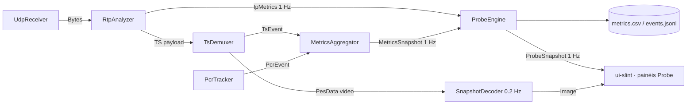

# Spec: Modo Probe — monitoração contínua sem player

- **Spec-IDs:** SPEC-PROBE-001 … SPEC-PROBE-016
- **Crates:** `crates/probe` (novo) · `crates/ui-slint` · `crates/net` · `crates/ts` · `src/main.rs`
- **Fase:** v0.4 — Probe (camada 1: IP → [spec-14-probe-ip](../spec-14-probe-ip/spec.md); camada 2: TS → spec-15, futura)
- **Origem:** `.notVersioned/Requisitos_Probe_MPEGTS_v0.4.docx` (recorte) + capturas de tela de uma probe comercial de referência (06/08/2026)

---

## 1. Contexto e objetivo

A operação usa hoje uma probe comercial de referência que monitora >400 canais
simultâneos a partir de um ponto fixo da rede. O equipamento é um servidor — não é transportável. Investigar um
problema em **outro** ponto de rede exigiria mover a probe, o que na prática não acontece.

O IronPlayer já recebe UDP/RTP multicast, demuxa TS, parseia PSI/SI e conta CC/CRC/PCR.
Falta transformar isso em **um instrumento que fica ligado sozinho por 12 h em um notebook
plugado no ponto de rede sob investigação, monitorando 1 ou 2 canais, e que ao final
responda uma pergunta objetiva: o stream nesse ponto está bom ou não?**

**Objetivo do modo Probe:** monitoração contínua, não assistida, de 1–2 feeds, com histórico
persistido, gráficos e linha do tempo de saúde, sem reprodução A/V contínua.

**Não-objetivo:** chegar ao nível da probe de referência. Esta spec cobre
deliberadamente um subconjunto (IP + TS) e descarta análise perceptual de vídeo/áudio, T-STD, HDR, loudness, logo, EPG,
SCTE-35, ABR e QoE score.

### 1.1 O que a probe de referência mostra e nós vamos reproduzir

| Tela de referência     | Elemento reproduzido no modo Probe                                  |
| ---------------------- | ------------------------------------------------------------------- |
| Summary (faixa colorida por hora) | Linha do tempo de saúde por bucket (SPEC-PROBE-009)      |
| IP Statistics          | Painel IP + gráficos jitter/inter-arrival ([spec-14](../spec-14-probe-ip/spec.md)) |
| Alerts (lista)         | Event log com severidade, ocorrências e contexto (SPEC-PROBE-008)   |
| Thumbnail de vídeo     | Snapshot 1 a cada 5 s, sem player (SPEC-PROBE-003)                   |
| Graphs                 | Séries temporais com rollup (SPEC-PROBE-005/010)                     |

---

## 2. Escopo

### 2.1 Dentro do escopo

- Seletor triplo de modo: **Cinema · Broadcast · Probe**.
- Pipeline reduzido no modo Probe: rede + TS + checks, sem decode contínuo e sem áudio.
- Snapshot de vídeo periódico (thumbnail) com descarte do anterior.
- Motor de checks com perfil versionado, debounce/histerese e severidade.
- Sessão de monitoração com histórico persistido em disco (≥ 12 h).
- Linha do tempo de saúde, gráficos com redução de pontos, event log filtrável.
- Reconexão automática e registro de indisponibilidade.
- Exportação de relatório de sessão.

### 2.2 Fora do escopo (explícito)

Freeze/black frame, blockiness, loudness, true peak, silence, HDR, GOP length, detecção de
logo, T-STD, buffer analysis, erros de sintaxe de elementary stream (MPEG-2/H.264/HEVC),
EPG, SCTE-35, ABR, QoE score, agregador central, API remota, descriptografia/CA.

Fora do escopo **desta** spec, mas planejado como camada 2 (spec-15): promoção dos checks
TS (CC, CRC, PAT/PMT error, PCR error/accuracy, PID error, sync loss, mudanças de tabela)
a checks versionados com histórico. Os contadores já existem (`TsEvent`, `PcrEvent`,
`ErrorTracker`) — a camada 2 é sobretudo empacotamento, não parsing novo.

---

## 3. Modelo de operação

### 3.1 Os três modos

```rust
/// SPEC-PROBE-001
#[derive(Debug, Clone, Copy, PartialEq, Eq, Default, Serialize, Deserialize)]
pub enum AppMode {
    /// Vídeo em tela cheia, painéis ocultos.
    Cinema,
    /// Player + painéis de análise (comportamento atual).
    #[default]
    Broadcast,
    /// Monitoração contínua sem reprodução.
    Probe,
}
```

| Recurso                              | Cinema | Broadcast | Probe                    |
| ------------------------------------ | ------ | --------- | ------------------------ |
| Recepção UDP/RTP + demux TS          | sim    | sim       | sim                      |
| PSI/SI + tabelas                     | sim    | sim       | sim                      |
| Métricas 1 Hz (`MetricsSnapshot`)    | sim    | sim       | sim                      |
| Decode de vídeo contínuo             | sim    | sim       | **não**                  |
| Render loop de vídeo                 | sim    | sim       | **não** (thumbnail 0,2 Hz) |
| Áudio (WASAPI/cpal)                  | sim    | sim       | **não** — device não é aberto |
| hwaccel D3D11VA / D3D11 VP           | sim    | sim       | **não** (SW no thumbnail) |
| Motor de checks + histórico em disco | não    | opcional¹ | sim                      |
| Painéis laterais de análise          | ocultos| sim       | substituídos pelos painéis Probe |

¹ Em Broadcast o motor pode ser ligado por configuração (`[probe] enabled_in_broadcast`),
mas o default é `false` — modo Broadcast não deve pagar o custo de escrita em disco.

### 3.2 Estado atual da UI

O toggle Cinema/Broadcast em [`appwindow.slint:957`](../../../crates/ui-slint/ui/appwindow.slint)
é hoje **estático** — dois retângulos sem `TouchArea`, sem callback e sem propriedade de
estado. Não existe `AppMode` no Rust. Portanto SPEC-PROBE-001 não é "adicionar um terceiro
botão": é criar o conceito de modo (Rust + Slint + persistência) e ligar os três.

---

## 4. Requisitos funcionais

| ID              | Requisito                                                                                                       | Critério de aceite                                                                                                       |
| --------------- | --------------------------------------------------------------------------------------------------------------- | ------------------------------------------------------------------------------------------------------------------------ |
| SPEC-PROBE-001  | Seletor triplo Cinema/Broadcast/Probe na barra superior, com `AppMode` em Rust e callback `set-mode(int)`         | Clique alterna o modo; modo ativo destacado; valor persiste em `[ui] mode` do `ironstream.toml` e é restaurado no start   |
| SPEC-PROBE-002  | Em modo Probe o pipeline A/V não é instanciado: sem `FfmpegDecoder` contínuo, sem `AudioOutput`, sem `VideoQueue` | Nenhum device de áudio aberto (verificável no Gerenciador de Som); CPU do processo < 15 % em 15 Mbps num Core i5 de notebook |
| SPEC-PROBE-003  | Snapshot de vídeo a cada `snapshot_interval_secs` (default 5 s), decodificado em SW, escalado para ≤ 320×180      | Somente 1 imagem viva em memória; a anterior é liberada ao publicar a nova; nenhum frame extra é decodificado entre ticks |
| SPEC-PROBE-003a | O snapshot arma o decoder no máximo `arm_window_secs` (default 2,5 s) antes do tick e desarma após 1 frame        | Sem IRAP na janela → `snapshot_state = "sem keyframe"`; não gera alarme por si só                                        |
| SPEC-PROBE-004  | Sessão de monitoração com `session_id`, início/fim, feed, host, interface, versão do app e versão do perfil       | Iniciar Probe cria a pasta da sessão; parar/fechar grava o resumo; sessão sobrevive a reconexões do feed                  |
| SPEC-PROBE-005  | Série temporal amostrada a 1 Hz + rollup de 60 s (min/avg/max/count) mantido em memória                           | 12 h de sessão ⇒ 720 buckets de 60 s em RAM; consumo do rollup < 2 MB                                                    |
| SPEC-PROBE-006  | Persistência append-only em disco: `metrics.csv` (1 Hz) e `events.jsonl`                                         | Matar o processo com `taskkill /f` perde no máximo `flush_interval_secs` (default 5 s) de amostras; arquivo permanece legível |
| SPEC-PROBE-007  | Motor de checks com perfil versionado: limiar, janela, duração mínima, histerese e severidade externos ao binário | Alterar limiar no TOML muda o resultado sem recompilar; o evento carrega `profile_version`                                |
| SPEC-PROBE-008  | Event log com abertura/atualização/fechamento, deduplicação e contagem agregada                                  | 1000 CC errors contínuos no mesmo PID ⇒ 1 evento com `count = 1000`, não 1000 eventos                                     |
| SPEC-PROBE-009  | Linha do tempo de saúde por bucket (default 5 min): pior severidade do bucket ⇒ cor                              | 12 h ⇒ 144 células; célula sem dado é cinza (distinta de verde); clique na célula filtra o event log daquele intervalo    |
| SPEC-PROBE-010  | Gráficos de sessão: bitrate total, PDV/inter-arrival, perda RTP/s, CC errors/s, CRC errors/s                      | Cada gráfico aceita janela 5 min / 1 h / 12 h / sessão inteira e nunca desenha mais de 1000 pontos                        |
| SPEC-PROBE-011  | Reconexão automática ao perder o feed, com backoff, e registro do período de indisponibilidade                    | Cabo removido por 30 s ⇒ 1 evento `feed_unavailable` com duração ≈ 30 s e retomada automática, sessão preservada          |
| SPEC-PROBE-012  | Enquanto a sessão está ativa, o Windows não suspende nem desliga a tela                                           | `SetThreadExecutionState(ES_CONTINUOUS \| ES_SYSTEM_REQUIRED)` ativo; liberado ao parar a sessão                          |
| SPEC-PROBE-013  | Autodiagnóstico: descartes locais (canal cheio, socket) e jitter de agendamento do próprio tick são medidos       | Painel "Saúde da probe" mostra `local_drops`, `sched_jitter_ms`; eventos de perda com descarte local no mesmo segundo são marcados `origin = local` |
| SPEC-PROBE-014  | Exportação de relatório de sessão em HTML autocontido + CSV bruto                                                | Um arquivo `.html` abre no navegador sem rede, com resumo, timeline, gráficos e top-10 eventos                            |
| SPEC-PROBE-015  | Seção `[probe]` no `ironstream.toml`, com `profile_version` e defaults gerados na ausência do arquivo             | Arquivo ausente ⇒ seção escrita com defaults documentados                                                                |
| SPEC-PROBE-016  | Retenção: sessões antigas removidas por idade (`retention_days`, default 14) ou por tamanho total (`max_disk_mb`) | Rotação nunca apaga a sessão em curso; remoção é logada                                                                  |

### 4.1 Requisitos de degradação (RNF operacional)

| ID              | Requisito                                                                                       | Critério de aceite                                                        |
| --------------- | ----------------------------------------------------------------------------------------------- | ------------------------------------------------------------------------- |
| SPEC-PROBE-013a | Sob sobrecarga, a probe degrada nesta ordem: 1) thumbnail, 2) rollups de UI, 3) séries secundárias | A recepção UDP e a contagem de perda/CC nunca são as primeiras a degradar |
| SPEC-PROBE-013b | A degradação é registrada como evento informativo, não silenciosa                                | Evento `probe_degraded` com o estágio acionado                            |

---

## 5. Arquitetura

### 5.1 Crate novo `crates/probe`

Direção de dependências (mantém a regra do [AGENTS.md](../../../AGENTS.md)):

```
probe → ts, net        (nunca o inverso)
ui-slint → probe, ts, av, net
av → ts
```

`crates/probe` concentra: motor de checks, estado de alarmes, séries temporais, escrita em
disco e exportação. Não parseia TS nem toca em socket — consome as APIs públicas de `ts`
e `net`.

> **Colisão de nomes:** já existe `ts::mediainfo::StreamProbe` e o exemplo
> `crates/av/examples/vp_probe.rs`. Os tipos novos usam o prefixo `Probe*`
> (`ProbeEngine`, `ProbeSession`, `ProbeEvent`) para evitar ambiguidade em `use`.

### 5.2 Fluxo de dados



**Decisão de projeto:** o `ProbeEngine` **amostra contadores acumulados**, não faz tee de
eventos brutos. `ErrorSnapshot` já expõe `cc_errors` por PID, `crc_errors` por
`(pid, table_id)`, `sync_losses`, `rtp_out_of_order` e `udp_overflows` de forma cumulativa
— a probe deriva o delta por segundo. Isso evita duplicar canais e mantém a regra de
"não duplicar métrica existente".

Eventos discretos que **não** cabem em contador (mudança de PAT/PMT, mudança de SSRC,
mudança de IP de origem, mudança de codec) chegam por um canal bounded dedicado
`probe_events` (cap. 1024, política: descarta o mais novo + incrementa `dropped_events`).

### 5.3 Threads

| Thread             | Papel                                                                 | Prioridade |
| ------------------ | --------------------------------------------------------------------- | ---------- |
| `net-recv`         | existente — `recv_from` + timestamp de chegada                        | acima do normal |
| `probe-engine`     | tick 1 Hz: amostra, avalia checks, atualiza séries, enfileira escrita | normal     |
| `probe-writer`     | drena a fila de escrita, `BufWriter` + flush a cada 5 s               | abaixo do normal |
| `probe-snapshot`   | arma/desarma decoder SW para o thumbnail                              | abaixo do normal |

O `probe-engine` **nunca** faz I/O de disco no próprio tick — só enfileira. Escrita lenta
(disco de notebook, antivírus) não pode atrasar a amostragem.

### 5.4 Troca de modo em runtime

Trocar de/para Probe reconfigura o pipeline A/V, não a recepção:

1. **→ Probe:** emite `TableEvent::ResetVideo` (nunca `Reset` — ver L-010 no
   [STATE.md](../../project/STATE.md)), encerra decoder/áudio, mantém socket + demux, inicia sessão.
2. **Probe →:** instancia decoder/áudio, encerra a sessão (fecha arquivos e grava resumo).

A sessão **não** sobrevive à troca de modo nem à troca de feed — cada uma abre uma nova
sessão. Sobrevive a reconexão do mesmo feed (SPEC-PROBE-011).

---

## 6. Formato dos dados em disco

Raiz: `<pasta do executável>/probe-sessions/` (mesma pasta do `ironstream.toml`, mantém a
portabilidade "copiar a pasta para o notebook").

```
probe-sessions/
└── 2026-08-07T09-15-32_239.15.0.183-50000/
    ├── session.toml      metadados: feed, host, iface, versões, início/fim, resumo
    ├── metrics.csv       1 linha/s
    ├── events.jsonl      1 linha/evento (abertura, atualização, fechamento)
    └── report.html       gerado sob demanda (SPEC-PROBE-014)
```

### 6.1 `metrics.csv` — colunas mínimas da camada base

CSV foi escolhido de propósito: 12 h × 1 Hz = 43 200 linhas ≈ 9 MB, abre direto no Excel,
que é onde a análise pós-monitoração de fato acontece.

```
ts_utc,uptime_s,connected,bitrate_kbps,null_ratio,
cc_errors_delta,crc_errors_delta,sync_loss_delta,pcr_jitter_delta,pcr_disc_delta,
local_drops_delta,sched_jitter_ms,worst_severity
```

As colunas da camada IP (RTP/FEC/jitter/inter-arrival) são definidas em
[spec-14-probe-ip §6](../spec-14-probe-ip/spec.md#6-persistência-da-camada-ip) e anexadas
à mesma linha. A ordem das colunas é fixa e versionada por `csv_schema_version` em
`session.toml`.

### 6.2 `events.jsonl`

Um objeto por linha (`serde_json`; adicionar `serde_json = "1"` às deps do workspace —
já presente no `Cargo.lock` de forma transitiva):

```json
{"event_id":"01J...","check_id":"rtp_missing","phase":"open","severity":"error",
 "ts_utc":"2026-08-07T13:55:07.555Z","first_seen":"...","last_seen":"...",
 "count":130,"duration_ms":0,"measured":130.0,"threshold":0.0,"unit":"pkts",
 "context":{"pid":null,"service_id":null,"ssrc":"0x1A2B3C4D","origin":"network"},
 "profile_version":1}
```

`phase ∈ {open, update, close}`. Regra de deduplicação: a mesma
`(check_id, context)` só abre um evento; enquanto ativo, recebe `update` a cada
`summary_interval_secs` (default 60 s) com a contagem agregada.

---

## 7. Modelo de check e severidade

```rust
/// SPEC-PROBE-007
pub struct CheckDef {
    pub id: &'static str,
    pub layer: Layer,            // Ip | Ts
    pub threshold: f64,
    pub unit: &'static str,
    pub window: Duration,        // janela de avaliação
    pub min_duration: Duration,  // debounce de abertura
    pub clear_duration: Duration,// histerese de fechamento
    pub severity: Severity,      // Critical | Error | Warning | Info
    pub enabled: bool,
}
```

Política inicial de severidade (ajustável por perfil):

| Categoria                                              | Severidade default |
| ------------------------------------------------------ | ------------------ |
| Feed indisponível, TS sync loss, PAT/PMT ausente        | Critical           |
| Perda RTP, CC error, CRC error, PCR error               | Error              |
| Jitter/inter-arrival fora do perfil, reorder, duplicata | Warning            |
| Mudança de PAT/PMT/codec/SSRC/IP de origem              | Info               |

**Antirruído obrigatório:** dedupe por `(check_id, context)`; debounce de abertura
(`min_duration`) e de fechamento (`clear_duration`); resumo periódico em vez de evento por
pacote. Sem isso, 12 h de sessão num stream ruim geram um log inútil.

---

## 8. UI do modo Probe

Layout quando `mode == Probe` (mesma janela, painéis trocados):

```
┌───────────────────────────────────────────────────────────────────────┐
│ [Cinema][Broadcast][ PROBE ]   udp://@239.15.0.183:50000  ● 03:34:21   │
├────────────────┬──────────────────────────────────────────────────────┤
│ thumbnail 5 s  │ LINHA DO TEMPO DE SAÚDE (144 células · 5 min)        │
│ 320×180        │ ▇▇▇▇▇▇▇▇▇▇▇▇▇▇▇▇▇▇▇▇▇▇▇▇▇▇▇▇▇▇▇▇▇▇▇▇▇▇▇▇▇▇▇▇▇▇▇▇▇   │
│                ├──────────────────────────────────────────────────────┤
│ RESUMO         │ Bitrate ─────────────  PDV / inter-arrival ────────  │
│ uptime         │ Perda RTP/s ─────────  CC errors/s ────────────────  │
│ disponibilidade├──────────────────────────────────────────────────────┤
│ pior evento    │ EVENT LOG  [filtro: severidade · check · período]    │
│ saúde da probe │ 13:55:07 Error rtp_missing 130 pkts  origin=network  │
└────────────────┴──────────────────────────────────────────────────────┘
```

- A faixa da timeline é o artefato-chave: depois de 12 h, é ela que responde "o stream
  está bom?" antes de qualquer gráfico.
- Gráficos reusam `line_path`/`area_path` de
  [`crates/ui-slint/src/lib.rs:1290`](../../../crates/ui-slint/src/lib.rs) com `Path` do
  Slint — nenhum widget de chart novo.
- **Redução de pontos obrigatória:** a UI desenha buckets do rollup, nunca a série 1 Hz
  crua. Ver L-007 no [STATE.md](../../project/STATE.md) — o femtovg já é o gargalo de
  render; 43 200 pontos por gráfico travariam a janela.
- Repintura dos painéis Probe: ≤ 1 Hz, com `cache-rendering-hint: true`.

---

## 9. Configuração (`[probe]` no `ironstream.toml`)

```toml
[probe]
profile_version         = 1
snapshot_interval_secs  = 5      # SPEC-PROBE-003
snapshot_arm_secs       = 2.5
snapshot_max_width      = 320
save_snapshot_on_error  = false  # evidência opcional; respeita "descarta o anterior"
sample_interval_ms      = 1000   # SPEC-PROBE-005
rollup_secs             = 60
timeline_bucket_secs    = 300    # SPEC-PROBE-009
flush_interval_secs     = 5      # SPEC-PROBE-006
summary_interval_secs   = 60     # SPEC-PROBE-008
reconnect_backoff_ms    = [1000, 2000, 5000, 10000, 30000]  # SPEC-PROBE-011
prevent_sleep           = true   # SPEC-PROBE-012
retention_days          = 14     # SPEC-PROBE-016
max_disk_mb             = 4096
enabled_in_broadcast    = false
```

Limiares por check ficam em `[probe.checks.<id>]` — definidos por camada nas specs
correspondentes.

---

## 10. Requisitos não funcionais

| ID          | Atributo         | Requisito                                                                                    |
| ----------- | ---------------- | -------------------------------------------------------------------------------------------- |
| RNF-PRB-001 | Autonomia        | 12 h ininterruptas sem intervenção, sem crescimento de memória (RSS estável após 1 h)         |
| RNF-PRB-002 | Precisão temporal| `Instant` (QPC) para intervalos; relógio de parede só nos timestamps exportados                |
| RNF-PRB-003 | Resiliência      | Nenhum panic em dado externo; seção/pacote inválido é isolado e contabilizado                  |
| RNF-PRB-004 | Recursos         | Todos os canais bounded; descarte contabilizado, nunca silencioso                              |
| RNF-PRB-005 | Disco            | Escrita ≤ 1 MB/min por sessão; rotação automática                                              |
| RNF-PRB-006 | Não regressão    | Com `mode != Probe` o comportamento atual de player é idêntico ao da baseline                  |
| RNF-PRB-007 | Testabilidade    | Motor de checks aceita fixtures determinísticas (relógio injetável), sem depender de rede real |

---

## 11. Critérios de aceite da fase

1. O seletor triplo funciona e o modo persiste entre execuções.
2. Em modo Probe, nenhum device de áudio é aberto e nenhum frame é renderizado além do
   thumbnail de 5 s.
3. Uma sessão de 12 h em stream real termina com `metrics.csv` completo, sem buracos além
   dos períodos de indisponibilidade registrados.
4. Retirar o cabo por 30 s gera exatamente um evento de indisponibilidade com duração
   correta e a sessão retoma sozinha.
5. A linha do tempo mostra as janelas com erro nas posições corretas quando comparada ao
   `events.jsonl`.
6. O relatório HTML abre sem rede e traz resumo, timeline e top-10 eventos.
7. Com `mode = Broadcast`, os testes de regressão existentes passam sem alteração.
8. `cargo test -p probe` verde e `cargo clippy --workspace -- -D warnings` limpo.

---

## 12. Sequência de implementação sugerida

| Ordem | Entrega                                                                      | Depende de |
| ----- | ---------------------------------------------------------------------------- | ---------- |
| 1     | `AppMode` + seletor triplo + persistência + gating do pipeline A/V            | —          |
| 2     | Crate `probe`: sessão, séries, writer CSV/JSONL, motor de checks com fixtures | 1          |
| 3     | Camada IP ([spec-14](../spec-14-probe-ip/spec.md))                            | 2          |
| 4     | Painéis Probe: timeline, gráficos, event log, saúde da probe                  | 2          |
| 5     | Snapshot de vídeo 5 s                                                        | 1          |
| 6     | Reconexão automática, anti-suspensão, retenção                               | 2          |
| 7     | Relatório HTML                                                               | 2, 4       |
| 8     | Camada TS (spec-15): promoção de CC/CRC/PAT/PMT/PCR a checks                  | 2          |

Ordem deliberada: a camada IP vem antes da TS porque é onde está o diagnóstico que a
probe de referência entrega e o IronPlayer ainda não (RTP, FEC, jitter), e porque os checks TS já têm
os contadores prontos — são os mais baratos de empacotar depois.

---

## 13. Decisões em aberto (a confirmar com a operação)

| # | Questão                                                                                                  | Default assumido nesta spec       |
| - | -------------------------------------------------------------------------------------------------------- | --------------------------------- |
| 1 | Monitorar 2 feeds simultâneos exige 2 pipelines completos — v1 entrega 1 feed por instância do app?       | 1 feed; 2º feed = 2ª instância    |
| 2 | Granularidade da timeline: 5 min (144 células/12 h) ou 1 min (720)?                                       | 5 min                             |
| 3 | Salvar thumbnail como evidência quando abre evento crítico?                                              | não (respeita "descarta o anterior") |
| 4 | Relatório precisa comparar duas sessões (ponto A × ponto B) já na v1?                                    | não — v1 exporta sessão isolada   |
| 5 | Limiares default: derivar dos números observados na referência (perda 5,6e-5, IAT 702 µs ± 0,34 µs) ou zero-tolerância? | ver [spec-14 §8](../spec-14-probe-ip/spec.md#8-limiares-default-propostos) |
